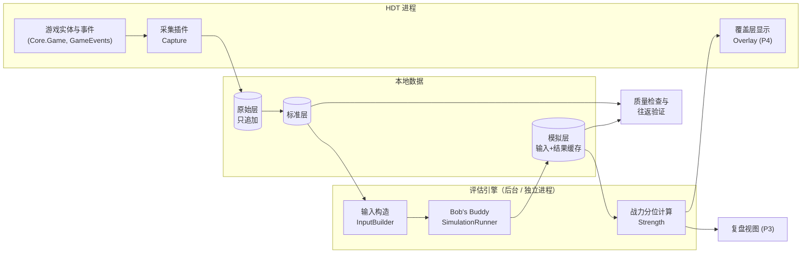

# 系统架构总览

> 这份文档回答：系统由哪些部分组成、数据怎么流动、代码打算怎么组织。内容要和已接受的 ADR 保持一致；标注"提议"的部分依赖尚未接受的 ADR。

**最后更新：** 2026-09-25（P0 初版；ADR-0002 / ADR-0006 已接受）

## 1. 组件与数据流



## 2. 组件职责

| 组件 | 职责 | 阶段 | 关联决定 |
| --- | --- | --- | --- |
| 采集插件 Capture | 在 HDT 内实现 `IPlugin`；在战斗开始及战斗中揭示信息时记录实体与标签；记录战斗结果；只读、只写本地 | P2 | ADR-0004（提议） |
| 原始层 | 按时间顺序只追加的事件与快照，带 schema 版本和插件版本 | P2 | ADR-0004（提议） |
| 标准层 | 对局、玩家、回合快照、随从、战斗结果；完整性标签 `ready/partial/unsupported/invalid` | P2 | ADR-0004（提议） |
| 输入构造 InputBuilder | 由标准层重建 Bob's Buddy `Input`；逻辑对照 HDT 的 `BobsBuddyInvoker` / `BobsBuddyUtils` | P2 | ADR-0002、ADR-0006 |
| 模拟层 | 规范化输入的哈希、模拟器版本、模拟结果缓存 | P2–P3 | ADR-0004（提议） |
| 质量检查与往返验证 | 采集完整率统计；用采集数据重跑模拟，对照 HDT 当场结果 | P2 | — |
| 战力分位计算 Strength | 参照池选择、批量模拟、S(x) 与分位、置信度 | P3 | ADR-0003 |
| 复盘视图 | 按回合展示分位、置信度、对手、结果，支持人工标注 | P3 | — |
| 覆盖层显示 | 局内低干扰显示分位与置信度 | P4 | — |

## 3. 关键设计约束

- **不改 HDT。** 所有功能都以插件或独立进程实现；HDT 源码只作参考。
- **只用本机已安装的模拟器。** 调用 `BobsBuddy.dll` 公开 API，不分发、不入库其二进制或反编译代码（ADR-0006）。
- **采集以模拟器输入为准。** 需要采集的字段以 `facts/bobsbuddy-simulator-input.md` 为依据，而不是以界面显示为依据。
- **战斗快照不是一个瞬间。** 战斗开始时拍快照，之后还要合并战斗中揭示的信息（对手手牌、奥秘、部分附魔等），HDT 自己也是这么做的。
- **可复算。** 每个结果记录卡牌数据版本、规则指纹、模拟器版本。

## 4. 代码目录规划（提议，P2-T1 时确认）

```text
src/
  HdtBgHelper.Plugin/     # net472 x64，IPlugin 实现，只负责采集与显示
  HdtBgHelper.Core/       # 数据模型、schema、标准层投影、完整性判定
  HdtBgHelper.Sim/        # InputBuilder 与 Bob's Buddy 调用封装
  HdtBgHelper.Engine/     # 参照池、批量模拟、分位计算（可作为独立进程运行）
tests/
  HdtBgHelper.Core.Tests/
  HdtBgHelper.Sim.Tests/  # 包含往返验证的固定样例
tools/                    # 数据质量报告、导入导出等命令行工具
analysis/                 # 离线分析（语言待定，可能用 Python / Notebook）
```

外部 DLL（`HearthDb`、`BobsBuddy`、`Hearthstone Deck Tracker.exe` 等）从本机 HDT 安装目录引用，不提交到仓库（ADR-0006、Q-005）。
