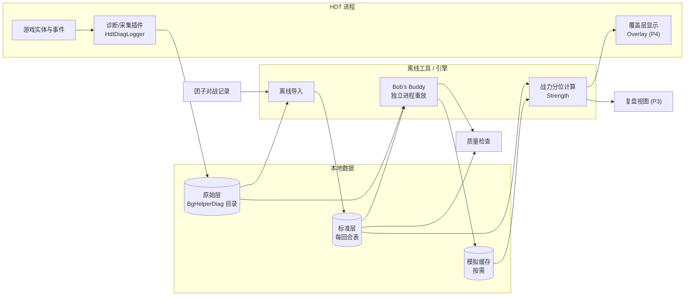

# 系统架构总览

> 这份文档回答：系统由哪些部分组成、数据怎么流动、代码打算怎么组织。内容要和已接受的 ADR 保持一致。

**最后更新：** 2026-10-05（P2-T3：标准层导入 CLI 落地）

## 1. 组件与数据流


```mermaid
flowchart LR
    subgraph HDT["HDT 进程"]
        G["游戏实体与事件"]
        P["诊断/采集插件<br/>HdtDiagLogger"]
        UI["覆盖层显示<br/>Overlay (P4)"]
    end
    subgraph Local["本地数据"]
        R[("原始层<br/>BgHelperDiag 目录")]
        N[("标准层<br/>每回合表")]
        S[("模拟缓存<br/>按需")]
    end
    subgraph Offline["离线工具 / 引擎"]
        Imp["离线导入"]
        BB["Bob's Buddy<br/>独立进程重放"]
        E["战力分位计算<br/>Strength"]
    end
    TU["团子对战记录"]
    Q["质量检查"]
    RV["复盘视图 (P3)"]

    G --> P --> R
    R --> Imp
    TU --> Imp
    Imp --> N
    R --> BB
    N --> BB
    BB --> S
    N --> E
    S --> E
    N --> Q
    BB --> Q
    E --> UI
    E --> RV
```

## 2. 组件职责

| 组件 | 职责 | 阶段 | 关联决定 |
| --- | --- | --- | --- |
| 采集插件 | 沿用 `HdtDiagLogger`：局内只读、只写本地 diag 目录；不跑模拟、不算分位 | P2 | ADR-0004、ADR-0010 |
| 原始层 | `BgHelperDiag/<id>/`：`meta.json`、`records.jsonl[.gz]`、`power.log.gz` | P2 | ADR-0004、`design/P2-data-capture.md` |
| 标准层 | 离线导入：每回合一行（Input/Output 引用、战果来源、完整性）→ `tools/standard_layer`，输出 JSONL | P2-T3✓ | ADR-0004、ADR-0008、ADR-0009 |
| 主模拟输入 | 直接使用转储的 HDT `_input`；实体快照仅后备，P2 不实现 InputBuilder | P2+ | ADR-0010 |
| 模拟 / 重放 | 按 `meta` BB 版本在独立进程调用本机 `BobsBuddy.dll` | P2-T0+ | ADR-0002、ADR-0006 |
| 质量检查 | 完整率、团子对照、重放偏差、升级冒烟 | P2-T3 | — |
| 战力分位计算 | 参照池、批量模拟、S(x) 与分位、置信度 | P3 | ADR-0003 |
| 复盘 / 覆盖层 | 赛后视图（P3）、局内显示（P4） | P3–P4 | — |

## 3. 关键设计约束

- **不改 HDT。** 插件或独立进程；HDT 源码只作参考。
- **只用本机已安装的模拟器。** 不分发、不入库 BB/HDT 二进制或反编译代码（ADR-0006）。
- **采集以模拟器输入为准。** 主路径是 HDT 已构造的 `_input`（ADR-0010），字段依据见 `facts/bobsbuddy-simulator-input.md`。
- **战斗快照不是一个瞬间。** HDT 会在战斗中更新 `_input` 并重跑；记录须覆盖重跑，选用规则在导入侧。
- **可复算。** 结果关联卡牌数据 / 模拟器版本（来自 `meta`）。
- **采集轻量、计算异步**（ADR-0004）。

## 4. 代码目录规划

```text
spikes/
  hdt-diag-logger/        # 采集插件（P2-T2 已转正语义，代码仍可住在 spikes）
  replay-harness/         # 离线重放（P2-T0）
tools/
  standard_layer/         # P2-T3 离线导入 + 质量报告
src/                      # 正式代码：后续引擎可迁入
tests/
analysis/                 # 离线分析（语言待定）
```

外部 DLL 从本机 HDT 安装目录引用，不提交到仓库（ADR-0006、Q-005）。
