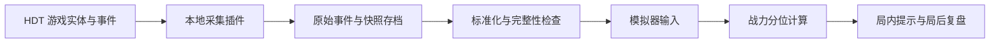

## Q1

我想讨论一个利用数据分析、机器学习/深度学习算法、插件开发等工程化方式，辅助我提升炉石传说酒馆战棋水平的完整的工程方案。 其中的困难可能包括： 可使用的结构化的数据数量少，大部分是我自己参与的对局，数量非常有限，相对于游戏的复杂度而言这个数据量很难覆盖足够多的情况。 对于特定局的随机性可能使得每一局在某些方面代表性一般，比如当局的随机种族情况、我和对手的英雄选择、当局的运气（遇到对手的强度、发牌情况等）、饰品/畸变等事件差异。变量数量很多，"特征工程"难度比较大。 最终目标不是训练出一个可以的ai程序，而是让我技术提高，这不是纯工程问题，而是对局、数据分析、复盘、再对局的人机协同问题。 游戏版本每几个月会大更新，每几周可能有小更新，但我希望落地的方案可以免于受更新的大影响，可以接受通过微调其中一些模块来适配每个新版本。 其中我调研到可以借助的工具包括： HSreplay 会员可以查看的大数据统计当前版本英雄胜率、阵容胜率。 HDT 插件可以记录我参与的每一局的数据，包括所有人选择的英雄、每一轮所有人的对局胜负、每一轮对战时我和对手的全体场面数据（随从清单和每个随从的详细信息）。 HDT 开源代码中附带有给定两个阵容，模拟对战计算双方胜率的工具。 通过一些已知参数可以推算在每个酒馆等级、某个当局种族分布下每一搜可以搜到特定牌的概率。 通过开发 HDT 插件可以使我在每场对局中快速收集和计算对我有帮助的信息。 我可以找到一些高手的比赛录像，如果可以搭以对录像中对局数据结构化分析的工具（需要自己开发，前提是如果可以开发成功的话，因此这一点是不确定的），会是高质量数据补充，数据量也会比自己的对局多，但受限于观战视角每局数据内容会比 HDT 记录的自己对战少。

## A1

我认为信息足够做一期完整方案设计，不需要先卡住。但真正开工前要确认 4 个前提：你主要在 Windows/HDT 环境玩；你接受局内只显示少量辅助信息，重分析放到赛后；HSReplay 数据只做人工导入或合规导出，不默认爬会员页面；目标是提升决策与复盘质量，不做自动代打或操作宏。

可行性结论

这个系统可行，但核心不应是“训练一个战棋 AI”，而应是“个人数据采集 + 外部大盘基准 + 概率/模拟器 + 复盘工作流 + 小模型辅助归因”。

高可行：HDT 插件采集、个人对局数据库、战斗胜率/运气归因、搜牌概率、英雄/曲线/阵容复盘、赛后仪表盘。

中可行：局内建议、商店回合 EV 估计、高手录像半自动结构化、个性化弱点模型。

低可行或不建议一期做：端到端强化学习、完整商店行动模拟器、自动从录像无监督还原整局所有状态。

我核对到的工具前提也基本成立：HDT 仍支持插件，插件可读取 Game、Game.Entities 和事件；官方 wiki 说明插件实现 IPlugin、通常以 .NET Framework 4.7.2 开发，并可用 API.GameEvents、实体标签等信息。已有 Battlegrounds-Match-Data 插件能记录英雄、名次、MMR、升本回合、每场战斗双方随从属性/关键词/对手英雄/回合/结果，说明你的数据采集设想不是空中楼阁。Bob’s Buddy 也确实是基于双方场面做大量战斗模拟，HDT 源码里能看到默认 10,000 次模拟常量。来源：HDT 插件文档、HDT 仓库、Battlegrounds-Match-Data、Bob’s Buddy 介绍与源码。

HDT plugin docs / HDT repo / Battlegrounds-Match-Data / Bob’s Buddy / BobsBuddyInvoker

系统目标

系统不追求“告诉你每手最优”，而追求 5 件事：

1. 让你知道自己输赢中哪些是决策，哪些是运气。

2. 把每局压缩成少数几个高价值复盘点。

3. 长期识别你的习惯性弱点，例如贪升本、过早转型、滚牌过度、站位质量差。

4. 在局内提供低干扰的概率和提醒。

5. 每个版本更新后，只需更新卡池、种族、机制标签和少量规则，不推倒重来。

---

## Q2

想到另一种思路，把过于多的变量，通过我的先验游戏理解，先压缩和简化到特定的维度：本局方向和阵容战力。

假设每一局总是在某一回合确定方向，在此节点之前只考虑正常升本节奏前提下的战力最大化，在此节点之后只考虑补全该方向的完整度。并且假设方向决定后不做调整。这是一种对复杂性的简化，先假设仅这样做，只要执行到位，足以达到一个较高的水平。

其中，阵容战力是指，我希望用一个数值或一组数值表达某一特定阵容的战力。这样，通过数据积累和复盘，可以知道每一回合，多少当前战力、多少每回合战力成长是符合预期的。也可以通过收集常见的阵容模式，计算每个阵容的战力成长期望。

本局方向的内涵包括：哪一回合确定本局阵容方向（我可以对每场对局手动标记）、该方向在当前情况下是否合适（考虑血量、回合数、关键随从完整性），这是一个复盘点，通常这个复盘会有3种结果：方向选择不合适（关键随从不完整）、决定方向太晚了（对该方向而言，此时回合数太晚、血量太低）、决定是合适的。

 对于每种成型阵容，很容易预先知道他们的关键随从，以及决定方向后凑齐的时间期望、最近几个回合的战力增长期望，数值计算很容易。

那么，核心问题转换成了，如何给出一个有效的评估战力方法（以及持续优化该评估方式）。如何在有战力评估方式后，工程化的完成上述的复盘流程所需的计算，以及配套的局内提示工具。

---

## Q3

我又考虑了一下，底层框架可以再简化到战力这一个层面，方向抉择合理性是战力+回合+血量+当前牌的次级要素。而对于战力，阵容完整度和当前战斗强度我觉得不需要：阵容完整度是静态的，实际情况更多更繁琐；当前战斗强度是后验的，实际上更有价值的是开始战斗前的评估，当前回合战力分位是更好的。此外未来 1-3 回合成长率也过于遥远，不如直接对当前回合的经济能力评分。

先考虑当前回合战力分位。考虑到不同版本有大量的饰品、任务、英雄技能、版本特色机制等多维影响要素，我觉得通过阵容本身做数值计算，不如基于收集到的对手和自己每局每回合的（足够进行战斗模拟的）全部数据，利用阵容与大量历史阵容数据在战斗模拟器的结果来做某一特定局面的战力分位评估。这样天然具备版本大变更或数值微调后的自适应性（只要收集的数据齐备、且战斗模拟器与阵容版本兼容）。

在这个前提下，数据收集和战力判断引擎是最重要的。

## A3

下面把系统限定在两件事：**把每回合的真实状态可靠地收下来**，以及**把当前战力定义成可比较、可复算的分位数**。这个方向可行，但关键条件是“历史阵容”必须是足够完整、能交给模拟器的战斗状态；单独一份随从清单远远不够。

## 一、先把战力分位定义清楚

战斗模拟器回答的是“阵容 A 对阵阵容 B 会怎样”，它本身不会给一个阵容独立的绝对战力值。要得到一个分位，必须指定参照对手分布。

我建议把主指标定义为：

> **本回合战力分位：当前场面与一组同类历史场面逐一模拟后，当前场面的标准化战斗表现超过多少比例的参照场面。**

对某个场面 x，从符合条件的历史参照场面中抽样 b_i，模拟 x 对 b_i，得出胜、平、负概率。主分数先用简单、容易解释的“胜当 1 分，平当 0.5 分”：

S(x) = \frac{\sum_i w_i \left(P(\mathrm{win}\mid x,b_i)+0.5P(\mathrm{tie}\mid x,b_i)\right)}{\sum_i w_i}

其中 w_i 是参照场面的权重。再把当前场面的 S(x) 放到同一参照群体里排序，得到战力分位。

分位的含义不是“这个阵容有 80 分”，而是：**在指定回合、规则与参照玩家群体中，它的战斗表现超过约 80% 的历史场面。**它是相对值，参照群体变了，分位也可能变。

建议同时保留几项辅助结果，但不要先揉成一个分数：

- **主指标**：标准化胜率分数 S(x) 及其分位。
- **辅助指标**：预期受到的战斗伤害、严重战败概率、模拟置信区间。
- **上下文**：回合、酒馆等级、种族池、英雄、任务/饰品等特殊规则，以及参照样本量。

这样可以避免“胜率差不多，但输时掉血差很多”的场面被一个数字掩盖。HDT 自带的 Bob’s Buddy 代码已经有模拟结果统计入口，包括胜负率、死亡率和伤害结果，因此这些输出类别与现有模拟器方向相符；但它当前能否作为稳定的外部批量调用接口，仍应作为早期原型的验证项。[HDT 的 Bob’s Buddy 调用代码](https://github.com/HearthSim/Hearthstone-Deck-Tracker/blob/master/Hearthstone%20Deck%20Tracker/BobsBuddy/BobsBuddyInvoker.cs)

## 二、数据收集方案

### 1. 采集单位：每回合的状态快照

每局记录一条局级信息，每位玩家每个回合记录一个快照，并记录实际对战双方和结果。重点是快照必须对应**进入战斗前的场面**，否则战力分位会混入战斗后的状态。

建议保存三层数据：

| 层   | 保存内容                                     | 用途              |
| --- | ---------------------------------------- | --------------- |
| 原始层 | HDT 可取得的原始实体、标签、事件及未知字段，带时间顺序和 schema 版本 | 以后字段解释改变时可重新解析  |
| 标准层 | 统一格式的对局、玩家、回合快照、随从、战斗结果                  | 查询、去重、分组和数据质量检查 |
| 模拟层 | 规范化后的模拟器输入、模拟器版本、模拟结果                    | 算分、缓存和复算        |

不要只导出 CSV 作为唯一存档。CSV 适合分析，但难以保留实体标签、未知字段、规则变动和原始事件顺序。较稳妥的首版是本地 append-only 原始记录，再投影到 SQLite 或 Parquet 等分析格式。

HDT 已有的插件生态和 Battlegrounds 记录插件，证明通过插件记录每回合双方随从属性、关键词、英雄、回合及战斗结果是现实的起点；HDT 的插件文档也描述了插件接口、游戏事件和游戏实体访问路径。[HDT 插件开发文档](https://github.com/HearthSim/Hearthstone-Deck-Tracker/wiki/Creating-Plugins) [Battlegrounds Match Data 插件](https://github.com/jawslouis/Battlegrounds-Match-Data)

### 2. 每条局级记录要保存什么

至少记录：

- `game_id`、开始/结束时间、补丁号、HDT 版本、数据 schema 版本。
- Solo/Duos 模式、赛季/规则模式、酒馆种族池或禁用种族、畸变等大厅规则。
- 每名玩家的座位、英雄与英雄技能、最终名次、可获取的 MMR 变化。
- 每回合该玩家的酒馆等级、当前血量/护甲、回合阶段，以及该回合是否成功采集。
- 任务、饰品、伙伴、英雄技能强化等改变战斗的状态。

玩家标识建议在本地匿名化；如果不需要跨局识别对手，就不保存 BattleTag。

### 3. 每个回合快照要保存什么

每个参战玩家至少保存：

- 回合号、快照阶段、玩家和对手身份、双方可见状态。
- 双方战场随从的**实体清单与顺序**：卡牌 ID、金色状态、攻击、生命、关键词、嘲讽、复生、圣盾、剧毒等战斗属性。
- 附魔与临时效果、来源或效果标签、磁力/合体信息、亡语与召唤相关信息。
- 影响战斗的英雄技能、任务奖励、饰品、畸变和特殊模式规则。
- 双方酒馆等级、生命/护甲等模拟器需要的玩家级状态。
- 是否存在未知随从、未知标签或缺失字段；每个字段或快照带采集置信状态。

采集对象要以模拟器输入要求为准，而不是以“画面上看得到什么”为准。比如同一张牌可能因为金色、附魔、临时效果或特殊规则而变成不同战斗状态；实体排列也可能影响攻击顺序。**没看到的信息要记为未知，不能默认其不存在。**

现在已经有插件能按回合记录己方和对手的随从属性、关键词与战斗结果，说明数据采集有可复用基础；但完整战斗重建还需要验证能否覆盖上述效果和规则上下文。[Match Data 插件记录字段](https://github.com/jawslouis/Battlegrounds-Match-Data)

### 4. 插件与采集管线

插件职责应保持简单：

插件在对局中只负责读取、标记阶段和写入本地数据。批量模拟及分位计算放到后台进程，避免在游戏事件处理线程里做重活。插件每次启动应记录自身版本，并且通过可关闭、可卸载的生命周期管理采集行为。HDT 插件文档提供了现有插件接口与游戏实体访问的开发入口，但具体可读字段仍需用当前 HDT 版本做原型核实。[HDT 插件文档](https://github.com/HearthSim/Hearthstone-Deck-Tracker/wiki/Creating-Plugins)

推荐为每条快照建立“模拟就绪”状态：

- `ready`：当前模拟器能够完整解释。
- `partial`：缺少部分上下文，只能用于明确标注过的近似比较。
- `unsupported`：存在模拟器不认识的卡牌、规则或效果。
- `invalid`：字段冲突、顺序错误、采集异常。

分位计算默认只使用 `ready` 数据。否则，缺字段的快照可能被误当成弱阵容，直接污染评分。

### 5. 采集数据质量的验收

先验证输入是否可信，再谈评分是否有用：

- 同一玩家、同一回合不应重复生成互相冲突的快照；允许重放导入，但要幂等去重。
- 用人工对照若干局的 HDT 画面和保存结果，检查卡牌、属性、顺序、特殊效果。
- 记录每局、每回合的成功率，以及 `ready/partial/unsupported` 占比。
- 选取已有对局，回放实际双方状态做模拟。模拟胜率不需要“预测中当局结果”，因为单场结果有随机性；但模拟输入必须能正确重建双方状态。
- 补丁、HDT 或模拟器升级后，跑一批固定状态的回归样例，并标记数据适用的模拟器版本。

这里有一个现实限制：实际发生的一场战斗只是随机模拟中的一次结果，不能用“模拟胜率是否等于这一次输赢”来验收模拟器。应分别检查状态重建正确性、对照可观察机制，以及多场结果的统计校准。

## 三、战力判断引擎

### 1. 参照场面如何选

每个历史快照都应带有足够的上下文，以便建立若干层参照池。建议先按以下因素过滤，再根据样本量逐步放宽：

1. 游戏模式、赛季规则、模拟器兼容性。
2. 同一补丁；卡牌数值或关键机制变更时重新评估兼容。
3. 同回合或非常接近的回合。
4. 同酒馆等级、种族池、畸变或其他会改变战斗的规则。
5. 仅使用采集完整、可由当前模拟器重建的快照。

主产品先做**同补丁、同规则的实战参照池**。若严格匹配后的有效样本太少，应显示“样本不足”或扩大条件并标注扩大范围，不要悄悄拿不相干的阵容补齐。

参照池的历史样本来自真实玩家，所以分位表达的是相对于这些玩家在这些时点的战斗表现。玩家水平、策略选择、生存到该回合的条件都会影响它。这正适合作为实战定位指标，但不应解释成脱离玩家群体的“阵容固有战力”。

### 2. 批量模拟与分位计算

对每个候选快照 x：

1. 根据上下文生成参照集合 B_x。
2. 用当前模拟器逐一模拟 x 对阵每个 b_i，得到胜/平/负概率和伤害结果分布。
3. 按参照权重 w_i 聚合为 S(x)。
4. 把当前快照与同一参照群体中的历史快照以相同方式评分，再计算 S(x) 的加权分位。
5. 返回分位、模拟不确定度、参照样本数、有效样本量和匹配条件。

这是“当前场面与大量历史场面在模拟器中对战”能变成清晰统计定义的方式。另有开源战斗模拟器可执行重复战斗并统计结果，但其仓库说明了实现差异和机制细节可能造成模拟偏差。因此实际采用哪一个模拟器，必须以对目标补丁、特殊效果的覆盖和可复算能力做原型评估，不能仅凭“有战斗模拟器”就视为版本兼容。[开源战斗模拟器说明及限制](https://github.com/twanvl/hearthstone-battlegrounds-simulator)

### 3. 计算成本与稳定性

若每个新快照都与所有历史快照进行大量随机模拟，计算量会快速增长。工程上可以这样控制：

- 对标准化后的完整战斗状态生成哈希，相同状态只算一次。
- 缓存每一对状态在特定模拟器版本下的结果。
- 每个参照组分层抽样，并按上下文权重加权，避免简单随机抽样漏掉少数重要场面。
- 对初步结果差异大的配对增加模拟次数；胜平负已稳定的配对减少模拟次数。
- 提供蒙特卡洛误差或置信区间；样本不足、误差过大时展示“估计不稳定”。

对于候选场面自身的分位，不把它加入自己的基准池；训练、校准与验证数据也按**整局**切分，不能把同一局相邻回合拆到训练和验证两边。相邻回合高度相关，置信区间宜按局或大厅聚类估算。

### 4. 版本变化与自适应边界

“用战斗模拟器比较完整状态”可以减少对手工阵容打分表的依赖，但版本自适应有条件：

- 如果只是数值变化，且模拟器和卡牌数据已支持新数值，历史场面能否复用取决于它们是否仍能被一致地解释。
- 如果加入新机制、改变触发顺序或改变状态含义，旧快照可能无法在新规则下合理重放，必须标为不兼容，不能直接混入新版参照池。
- 新版本采集样本不足时，评分应显示置信度下降；HSReplay、高手对局数据或合成状态可以用于扩展覆盖，但来源要分别标记。
- 每次使用结果都记录规则指纹、卡牌数据版本和模拟器版本，让旧分数可以追溯与重算。

因此，版本适配不是“版本一更新，系统自动懂了”；更准确地说，是**采集格式保留充分信息，且模拟器能解释新状态时，历史数据才可能经重算继续使用**。HDT 现有 Bob’s Buddy 代码可以作为模拟器集成的首选调查对象；应先确认能否从插件或独立进程稳定提交任意两个完整场面，而不只是在正常战斗流程中运行。[Bob’s Buddy 模拟调用实现](https://github.com/HearthSim/Hearthstone-Deck-Tracker/blob/master/Hearthstone%20Deck%20Tracker/BobsBuddy/BobsBuddyInvoker.cs)

## 四、如何判断分位有没有价值

建议分三类评估，不把“最终名次”当唯一标准：

- **数据正确性**：保存状态和 HDT 可见状态一致；完整快照比例足够高。
- **模拟可信度**：机制支持覆盖率、已知交互回归、实际战斗结果的长期校准情况。
- **指标实用性**：战力分位是否能稳定区分该回合较强与较弱的场面；相同上下文下是否和后续承伤、战斗表现存在预期关系。

验证集按时间切分并整局留出。对真实战斗表现做验证时，比较模拟的胜率分布与大量实际结果，而不是要求单局预测正确。另做参照池重采样，检查某个分位是否因少量极端阵容而大幅跳动。

方向选择复盘时再把战力分位与回合、血量、当时可见牌结合。经济能力评分可以作为之后的独立信号；现在就采集当回合金币、酒馆状态和操作事件，有助于未来建立它，但不要把经济能力掺进战力分位。

## 五、推荐的落地顺序

1. **数据可行性原型**：HDT 插件记录单局双方每回合快照；选少量局人工核对字段与顺序。
2. **模拟器接入原型**：将快照转成模拟器输入，批量运行一组状态，验证任意场面配对是否可调用、性能是否可接受、特殊规则支持如何。
3. **离线战力分位 MVP**：只支持模拟器明确覆盖的场面，按补丁和规则建立参照池，输出分位、误差和样本信息。
4. **对局复盘界面**：时间线展示每回合战力分位、置信度、实际对手和结果，并允许你标注方向选择、关键牌与判断。
5. **局内提示**：待采集与离线引擎稳定后，再把分位缓存或低延迟计算接入插件；局内显示分位与置信度，不尝试自动操作。

**总体可行性判断：**数据记录和离线分位引擎都值得做；最大风险集中在战斗状态能否完整采集，以及 Bob’s Buddy 是否能稳定地作为任意阵容对阵的可调用模拟核心。先完成阶段 1 和 2 的小型验证，再投入完整评分管线。