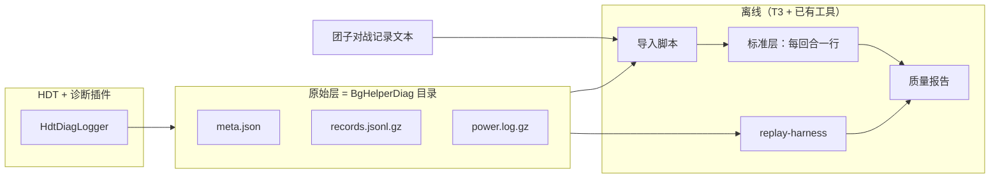

# 方案：个人局内数据采集（短方案）

- **状态：** approved（所有者 2026-10-05 对话确认：完成 P2-T1）
- **任务：** P2-T1
- **作者 / 日期：** agent / 2026-10-05
- **相关：** ADR-0004、ADR-0010、ADR-0008、ADR-0009；`facts/diag-capture-measured.md`、`facts/diag-capture-batch-20261003.md`、`facts/replay-roundtrip.md`、`facts/combat-result-reconstruction.md`；Q-002；roadmap P2 退出标准

## 1. 目标与非目标

**目标**

1. 钉死 P2 的数据边界：诊断记录目录即**原始层**；离线导入产出的每回合表即**标准层**。
2. 钉死主数据源：以 HDT `_input` / `Output` 反射转储为主，实体快照与 Power 行为后备（ADR-0010）。
3. 写清压缩与保留策略，以及 T2/T3 各自改什么、不改什么。
4. 可按本方案修正 P2 退出标准（见第 5 节；与 roadmap 现占位值一致，不另改数字）。

**非目标**

- 不另写新采集插件；不设计独立三层 schema / 迁移框架。
- 不在本任务实现插件补丁（P2-T2）或导入脚本（P2-T3）。
- 不实现从实体快照重建 `Input` 的 InputBuilder（仅留后备口子）。
- 不解决团子停更时的战果回退实现（方案留口子，T3 可只做标注）。

## 2. 依据

| 依据 | 结论 |
| --- | --- |
| 诊断插件 0.1.0 已采 48+ 局，537/539 场完整 `_input`+`Output` | 原始层格式已存在且可用 |
| P2-T0：261/261 场同版本往返通过 | `_input` 可作模拟原料，不必先造 InputBuilder |
| 团子对战记录可对照阵容/五率并给实际战果（ADR-0008） | 不必在插件内自建「复盘报告」管线 |
| 拔线允许、战果可还原（ADR-0009、Q-014） | 标准层须标注战果来源 |
| `records.jsonl` 约 10–28 MB/局、活跃期可达 GB/月 | 必须压缩与保留策略 |
| Q-002 仍 investigating（大版本反射改名） | 主路径依赖反射；失败时退到实体后备并降级完整性 |

**假设：** 团子文本格式短期稳定。若不成立：实际战果退回 diag 上下文还原（已有方法），名次退回实体标签；配对逻辑改解析器即可。

## 3. 方案

### 3.1 数据流

### 3.2 原始层（已有格式，不再另造）

位置：`%APPDATA%\HearthstoneDeckTracker\BgHelperDiag\<开局时间>_<短 id>\`（异地带回可放仓库外的 `data/BgHelperDiag/`，**不入库**）。

| 文件 | 角色 |
| --- | --- |
| `meta.json` | 插件/HDT/BB/HearthDb 版本、`schemaVersion`、错误计数 |
| `records.jsonl`（T2 起局末改为 `.gz`） | `event` / `combat_flag` / `entities` / `hdt_bb` / `perf` / `error` |
| `power.log.gz` | 匿名化后的 Power 行（已压缩） |
| `salt.txt` | 本机匿名化盐（不入库） |

`schemaVersion` 与插件版本继续写在 `meta`；跨 BB 字段增减（如 `DiscardCounter`）按 `meta.bobsBuddy.fileVersion` 分桶处理，不另建演进体系。

### 3.3 标准层（T3 生成，本方案只定形状）

每回合一行（实现介质由 T3 选定：JSONL / Parquet / SQLite 表均可；须可被 P3-T0 直接读取）。建议列：

| 列 | 来源 |
| --- | --- |
| `gameId`、`turn`、对手英雄 | diag + 配对 |
| `inputRef` / `outputRef` | 指向该回合选用的 `hdt_bb`（或内嵌摘要） |
| `result`、`damage`、`placement` | 团子优先；否则 HDT / 排行榜差分还原 |
| `resultSource` | `tuanzi` / `hdt` / `lb` / `unknown` |
| `status` | `ready` / `partial` / `unsupported` / `invalid` |
| `replayDelta`（可选） | 同版本 BB 重放相对记录 Output 的偏差 |

完整性（与 roadmap / rescope 一致）：

- `ready`：单人、有本场 Combat `Output`、非中途启用插件
- `partial`：清单缺口字段非零、双人、或其他可模拟但不完整
- 直接拔线无阵容 / 无 Combat → 不记为 `ready`（可单独标记缺失）

### 3.4 主数据源与后备（ADR-0010）

1. **主路径：** 取本场 `2022=0` 之后 / `combat_phase=true` 分段内的 `hdt_bb`，用最终（或选定）`_input` + `Output`。
2. **脏数据在导入侧处理：** 残留 invoker 过滤、匿名化键修复（`Player` / `$type` 等）；T2 修插件匿名化，避免新数据再腐。
3. **后备：** 仅当反射读不到 `_input`、或某版本 dump 无法还原时，才考虑 `entities` / `power.log.gz` 重建；重建结果默认最高 `partial`，并记入质量报告。P2 不实现重建器。

### 3.5 压缩与保留

| 策略 | 决定 |
| --- | --- |
| 压缩 | T2：对局结束后将 `records.jsonl` 压成 `records.jsonl.gz`（或等价）；`power.log.gz` 已压缩。导入工具须同时认 `.jsonl` 与 `.jsonl.gz` |
| 存放 | 原始层始终在本机 / 所有者自管目录；仓库只收统计与事实文档 |
| 保留 | 默认**全部保留**（个人机）；磁盘紧张时优先删已导入且质量报告通过的局的 `power.log.gz`，其次删旧 `records`；`meta` + 标准层行保留更久 |
| 量级 | 按实测：未压缩约 10–28 MB/局；gzip 后预期显著下降；活跃期按月监控占用即可，不设自动淘汰 |

### 3.6 与 T2 / T3 的边界

| 任务 | 做 | 不做 |
| --- | --- | --- |
| P2-T2 | 匿名化词边界；局末压缩 `records` | 不改「选哪条 hdt_bb」；不强制修 `2717` / `hearthstoneBuild` |
| P2-T3 | 配对、战果来源标注、完整性、质量报告、可选重放偏差列 | 不写新插件；不设计新原始格式 |

## 4. 考虑过的替代方案

| 方案 | 为什么不选 |
| --- | --- |
| 另写正式采集插件 + 新原始 schema | 诊断插件已够用；重复劳动且打断已有样本 |
| 以实体快照为主、自行 InputBuilder | 成本高；P2-T0 已证明 `_input` 往返可用；团子可校验场面 |
| 完整三层存储 + schema 演进框架 | 对个人规模过重；`meta.schemaVersion` + BB 分桶足够 |
| 插件内直接算分位 / 跑 BB | 违反 ADR-0004；拖慢 HDT |

## 5. 验收方式

P2-T1 本身是文档任务，验收：

1. 本文档 `approved`；ADR-0004、ADR-0010 `accepted`；`architecture/overview.md` 与本方案一致。
2. roadmap P2-T1 勾选；退出标准数字与第 3.3 节完整性定义无冲突。

后续 T2/T3 沿用 P2 退出标准（可再修正）：

- 连续 10 局中，非「直接拔线」回合 `ready` ≥ 90%
- `ready` 回合与团子阵容、五率、模拟次数 100% 一致
- 同版本 BB 重放胜/平/负率与记录之差在两次抽样合并误差 3σ 内

## 6. 风险与回退

| 风险 | 回退 |
| --- | --- |
| HDT 大版本反射字段改名（Q-002） | 冒烟：`check_capture` + 小样本 roundtrip；失败则该版本标记 `unsupported`，评估实体后备 |
| 团子格式变化 / 停更 | 战果走 ADR-0009 还原；名次走实体；标准层 `resultSource` 变化即可 |
| 体积仍过大 | 提高压缩优先级；淘汰旧 `power.log.gz`；实体快照采样而非每回合全量（需新 ADR） |

## 7. 任务拆分

| 步 | 内容 | 状态 |
| --- | --- | --- |
| T1a | 本方案 + ADR-0004 细化 + ADR-0010 | 完成（2026-10-05） |
| T2 | 插件：匿名化词边界 + 局末压缩 | 完成（2026-10-05，插件 0.2.0） |
| T3 | 离线导入 + 质量报告 | 完成（2026-10-05） |

## 8. 实现记录

### P2-T2（2026-10-05）

- 插件版本 **0.2.0**：`Anonymizer` 对已知玩家名用词边界替换（`[A-Za-z0-9_.]` 两侧），并跳过 BB 结构保留名（`Player` / `Opponent` / `Windfury` 等）的裸名替换；`Player#1234` 仍走 BattleTag 规则。
- `RecordWriter` 局末将 `records.jsonl` 压成 `records.jsonl.gz`（与 `power.log.gz` 相同；HDT 中途退出可能留下未压缩文件）。
- 工具侧新增 `tools/diag_io.py`，`check_capture` / 各 eval / `replay-harness/roundtrip.py` 同时认 `.jsonl` 与 `.jsonl.gz`。
- 未做（按方案可选）：`2717` 补录、`hearthstoneBuild` 推迟写入；残留 invoker / `2022=0` 选取仍在 T3。

### P2-T3（2026-10-05）

- 正式 CLI：`python -m tools.standard_layer`（见 `tools/README.md`）。输出 `data/standard/turns.jsonl` + `quality_report.{json,txt}`（`data/` 不入库）。
- 选取：`combat_phase` 分段内、`2022=0` 之后、`state=Combat` 且有 Input/Output 的 `hdt_bb`（最高 `reRunCount`）；匿名化键修复与 replay-harness 一致。
- 战果：团子实际结果 → HDT `LastAttackingHero`（无重连）→ 排行榜有效血量差；`resultSource` = `tuanzi` / `hdt` / `lb` / `unknown`。
- 完整性：`ready` = 单人 + 有 Combat Input/Output + 非中途启用；系统性清单盲区（未知手牌、Input 中 `2717` 恒 0）记入 `gapFlags` **不**单独降为 `partial`（否则 ready 远低于退出线，且转储仍是 HDT 当场模拟输入）。`direct_dc` / 无 Output → `missing`。
- 团子阵容对照：接受 Max\* 或 Base\* 攻血多重集（团子文案常印 BaseHealth）。
- 本机验证（2026-10-05）：全量 52 局 609 回合 ready 601/607（非 direct_dc）= **99.0%**；有团子配对的 7 局 78/82 = **95.1%**；ready∩团子适用回合阵容+五率 **78/78**；同版本 BB 重放 3σ **78/78**。字面「连续 10 局」未凑满；**所有者 2026-10-05 指示提前结束 P2**（见 `worklog/2026-10-05-p2-early-exit.md`）。
