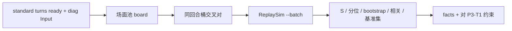

# 方案：核心假设早期验证（全交叉模拟）

- **状态：** implemented
- **任务：** P3-T0
- **作者 / 日期：** agent / 2026-10-05
- **相关：** ADR-0003、ADR-0004、ADR-0010；`facts/replay-roundtrip.md`、`facts/standard-layer-import.md`、`facts/diag-capture-batch-20261003.md`；Q-007、Q-008、Q-009

## 1. 目标与非目标

**要回答（有证据即可，不要求产品级引擎）：**

1. 用双方场面做全交叉模拟，按 ADR-0003 算 \(S(x)\) 与分位，单局/全队列计算成本是否可接受（对照 Q-009：赛后每局 ≤ 10 分钟）。
2. 分位随参照池大小的 bootstrap 稳定性（尤其同回合桶、小 N）。
3. \(S\)/分位与实际战果、承伤的相关性；相对 HDT 当场胜率有无增量信息。
4. 对照替代指标：对固定基准场面集的平均胜率。
5. 对手场面进参照池是否明显偏置（Q-007 / Q-008）。

结论用于约束 P3-T1 放宽规则；若区分度/稳定性明显不足，登记是否触碰 ADR-0003 推翻条件（正式推翻留给 P3-T4）。

**非目标**

- 不做正式缓存服务 / 插件 UI（P3-T2+、P4）。
- 不跨 BB 版本混模拟（本 spike 只用 **1.85.0.0**）。
- 不要求分位 CI 已达 P3 退出占位（≤20 百分位点）——只报告实测宽度。

## 2. 依据

| 依据 | 用法 |
| --- | --- |
| ADR-0003 | \(S(x)=\mathrm{avg}(P_w+0.5P_t)\)；分位=同参照群体内排序；整局留出 |
| P2-T0 往返 | `_input` 可还原；同版本五率可信 |
| P2-T3 标准层 | `ready` 行 + `output`/`result`/`damage` 作标签与 HDT 基线 |
| Q-009 | 单场 ~0.4 s 模拟；交叉规模需驻留进程批跑 |
| Q-008 | 严格同回合桶 N 小；需测稳定性与放宽 |

## 3. 方案



### 3.1 场面与交叉

- 每条 `ready` Combat 贡献最多 2 个场面：`Player` / `Opponent` 侧。
- **候选 x 默认只用己方 `Player`**（与「本回合战力」产品语义一致）；参照池默认同回合其他局的 `Player`，并另跑「参照含 Opponent」与「候选也含 Opponent」对照。
- 排除：自身；同 `gameId` 的场面（整局留出）。
- 拼装：以候选 Input 为壳（`DamageCap`/`turn`/`availableRaces`/`Anomaly`），`Player`←候选侧，`Opponent`←参照侧；按侧设置 `ControlledByPlayer`；清除双人队友；重映射 `$id`。
- **自洽冒烟：** 同场 `Player`+`Opponent` 拼回后，五率与记录 Output 在 3σ 内。

### 3.2 模拟执行

- 扩展 `ReplaySim`：`--batch jobs.jsonl`，进程内加载一次 BB，逐行 hydrate+模拟，stdout JSONL。
- 默认：`iterations=4000`，`threads=ProcessorCount/2`，`maxDuration=4000`（交叉用；冒烟可用 10000）。
- DLL：BB 1.85.0（`bb-dirs.json` / 团子 `C:\Program Files\HDT`）。

### 3.3 指标

| 符号 | 定义 |
| --- | --- |
| \(S(x)\) | 对参照池均等权重的 \(P_w+0.5P_t\) 均值 |
| 分位 | 同桶内 \(S\) 的经验 CDF（不含自身） |
| bootstrap | 对参照池有放回重采样 B=200，报分位 95% 区间宽度 |
| 相关 | Spearman：分位 vs 战果编码（胜1/平0.5/负0）、vs 承伤 |
| 增量 | 预测战果时，分位相对 HDT `winRate` 的 AUC/对数似然增益（样本允许时） |
| 基准集 | 固定 K=20 场面（按 turn 分层抽样），\(S_{\mathrm{base}}\) 同样相关对比 |

### 3.4 交付位置

| 路径 | 内容 |
| --- | --- |
| `spikes/strength-cross/` | 编排、拼装、分析、README |
| `ReplaySim --batch` | 驻留批跑（复用 hydrate） |
| `docs/facts/strength-cross-p3t0.md` | 结论 |
| `docs/worklog/` + `status.md` | 过程与下一步 |

## 4. 考虑过的替代方案

| 方案 | 为何不选（本任务） |
| --- | --- |
| 一场一进程 | 启动开销主导，交叉不可行 |
| 先上完整缓存服务 | 属于 P3-T2；本任务只需可复跑 spike |
| 跨全部 BB 版本 | DLL/机制漂移（Q-011）；先单队列 |

## 5. 验收方式

```powershell
& "C:\Program Files\dotnet\dotnet.exe" build spikes\replay-harness\ReplaySim -c Release -p:HdtDir="$env:LOCALAPPDATA\HearthstoneDeckTracker\app-1.58.6" -o spikes\replay-harness\ReplaySim\bin\run
python spikes\strength-cross\tools\cross_eval.py --bb-version 1.85.0.0 --smoke
python spikes\strength-cross\tools\cross_eval.py --bb-version 1.85.0.0 --run
```

通过：

1. 自洽冒烟通过率 ≥ 95%（抽样 ≥ 20 场）。
2. 产出全交叉结果与分析 JSON；事实文档写明成本、bootstrap、相关、增量、基准集、对手场面对照。
3. 对 P3-T1 给出明确约束条目（可写进 open-questions / 事实文末）。

## 6. 风险与回退

| 风险 | 缓解 |
| --- | --- |
| 拼装破坏 hydrate | 先自洽冒烟；失败则停交叉 |
| 同回合 N 过小 | 报告不稳定；试 turn±1 敏感性 |
| 拔线战果少 | 用 `resultSource` 分层；相关性可标弱证据 |
| 耗时超预期 | 降 iterations / 只跑 Player 池 / 限回合 ≤12 |

## 7. 任务拆分

1. 本方案。
2. `ReplaySim --batch`。
3. 拼装 + 冒烟 + 同回合交叉 + 分析脚本。
4. 跑 1.85.0 队列；写 facts / worklog / status / roadmap；必要时改 open-questions。

## 实现记录（2026-10-05）

- 交付：`spikes/strength-cross/` + `ReplaySim --batch`；结论见 `facts/strength-cross-p3t0.md`。
- 相对方案：主跑先做 `player_vs_player`，再用 `player_vs_both` 作对手场面对照；未跑 turn±1（留给 P3-T1）。
- 偏差：名次相关因配对局少（7）未得出可用结论；「相对 HDT 增量」明确为对本场对阵无增量，改由 P3-T4 换标签验证。
