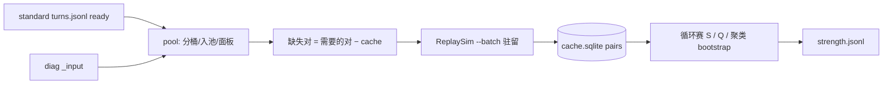

# 方案：战力分位引擎（参照池、放宽、抽样、缓存、置信区间）

- **状态：** review
- **任务：** P3-T1（同时给出 P3-T2 / P3-T3 的实现边界）
- **作者 / 日期：** agent / 2026-10-05
- **相关：** ADR-0003、ADR-0004、ADR-0010、[ADR-0011](../decisions/0011-strength-pool-round-robin.md)（proposed）；`facts/strength-cross-p3t0.md`、`facts/replay-roundtrip.md`、`facts/standard-layer-import.md`、`facts/combat-result-reconstruction.md`；Q-008、Q-011、Q-015、Q-016

## 1. 目标与非目标

**目标：** 把 P3-T0 的一次性交叉 spike 定型为可增量运行的离线引擎规格。对任意 `ready` 场面 x，输出：

| 输出 | 说明 |
| --- | --- |
| \(S(x)\) | ADR-0003 的加权平均得分 |
| 分位 \(Q(x)\) 与 95% 区间 | 区间同时计入参照抽样与蒙特卡洛误差 |
| 放宽级别与样本量 | 用了哪一级参照、多少局、多少场面；不悄悄补齐 |
| 附带量（不并入主分数） | 平均被打死概率、平均伤害、\(S\) 的蒙特卡洛标准误 |

"做完"的判据：本方案审阅通过；§3.8 的校准实验跑完，§3.9 的默认参数表全部填上实测值。

**非目标：**

- 不写正式代码（P3-T2 / P3-T3 再写）；校准实验放在 `spikes/strength-cross/`。
- 不做覆盖层和实时计算（P4）；不做复盘视图（P3-T5）。
- 不按种族或畸变分桶（Q-008 已否定）；不调权重去拟合战果（样本太少，留到 P3-T4）。
- 不做双人模式。

## 2. 依据

| 依据 | 对方案的约束 |
| --- | --- |
| ADR-0003 | \(S\) 定义；候选场面不进自己的参照池；按整局切分 |
| `strength-cross-p3t0` §8 | 同版本 + 同回合起步；不足时先加对手场面，再 turn±1；驻留批跑；按局面哈希缓存；参照 <≈8 时标"不稳定"；分位与 HDT 当场胜率并列显示，不能替代它 |
| Q-011 | 模拟必须用采集时同版本的 `BobsBuddy.dll` → 分桶键必须包含 BB 版本 |
| P3-T0 成本 | 单对 `elapsedMs` p50 ≈140 ms（4000 次）；驻留批跑时 hydrate ≈1 ms |
| 幽灵对手 | 对手英雄 CardId 含 `KelThuzad` 时是已出局玩家的旧场面（`combat-result-reconstruction` §5），不能当本回合参照 |
| 本机数据（2026-10-05 统计） | BB 1.85.0：28 局；每回合己方 `ready` 场面：t1–t10 为 19–23 个，t11 为 17 个，t12 为 14 个，t13+ ≤5 个。本赛季没有畸变（`Anomaly` 全为空） |
| 反对称性（本次补测，见 `strength-cross-p3t0` §10） | \(s(a,b)+s(b,a)\approx1\) 只是近似：96% 的对差值 ≤0.02，2.8% 的对差值 >0.05，最大 0.48。可用种族、伤害上限不同的对，长尾更重 → 每个方向都得单独模拟 |

**依赖的未决问题：**

- **Q-015（迭代次数）**：本方案先假设 4000 次。如果 E1 证明 1000 次就够，默认值就改为 1000，成本约降到 1/4，§3.5 的面板上限也可以放宽。
- **Q-016（新版本冷启动，新增）**：假设新 BB 版本前几天只能显示"样本不足"。如果 E5 证明跨版本参照偏差小，就启用 L2 放宽。

## 3. 方案

### 3.1 基本单位与分桶

- **场面** = （`gameId`, `turn`, `side`），来自标准层 `ready` 行的 `_input`。`side` 为 `Player`（候选），或为 `Opponent`（只当参照和同组成员）。
- **入池条件：** 单人模式；`status=ready`；有 `_input`；`Opponent` 侧还要求对手不是幽灵（`oppHeroCard` 不含 `KelThuzad`）。
- **桶** \(B(v,t)\) = BB 版本 v 且回合 t 的全部入池场面。可用种族、伤害上限、畸变只记录为协变量，不作为分桶键。
- **对局规则取候选方的：** 模拟 s(a,b) 时，以 a 的 Input 作外壳（`DamageCap`、`turn`、`availableRaces`、`Anomaly`），`Player` 侧放 a 的场面，`Opponent` 侧放 b 的场面。拼装沿用 `cross_input.make_cross_input`，P3-T2 时迁入正式代码。

### 3.2 分位定义：留一局的循环赛

P3-T0 的做法是：每个同组成员的 \(S\) 各自对着自己的参照集计算，这样大家用的参照集并不相同。正式版改成：在同一个参照群体里打循环赛，看 x 排在第几（ADR-0011）。

对候选 x（所属局 g）：

1. **参照群体** \(R(x)\) = 桶里不属于局 g 的全部场面（放宽级别见 §3.3）。
2. **对手集** \(O(x) = R(x) \cap C\)，其中 C 是该桶的参照面板（§3.5）。面板没满时 \(C\) 就是整桶。
3. \(S(x) = \sum_{b\in O(x)} w_b\, s(x,b) \,/\, \sum w_b\)，其中 \(s = P_\text{win} + 0.5\,P_\text{tie}\)。
4. 对每个 \(p \in R(x)\)：\(S_R(p)\) 取同样的加权平均，范围是 \(O(x)\) 里去掉 p 所在局的那些对手。
5. \(Q(x) = \dfrac{\sum_{p} w_p\left([S_R(p) < S(x)] + 0.5\,[S_R(p) = S(x)]\right)}{\sum_p w_p}\)，求和范围是 \(p \in R(x)\)。

这样定义的效果：

- x 和每个同组成员面对的是同一批对手（只差各自所在的局），排序可比。
- 候选 x 不需要被别人当对手打，所以给 x 打分只需要 \(|O(x)|\) 次新模拟；面板内两两对战的结果可以长期缓存复用。
- 局 g 的另一侧场面（本场对手）也被排除，满足"整局留出"。

**权重：** 同回合场面 \(w=1\)；放宽进来的场面 \(w=w_\text{relax}\)（默认 0.5，E3 校准）。对手侧场面不打折扣（P3-T0 未见毒化），但保留"只用己方"开关做回归对照。

### 3.3 放宽阶梯

用 \(G(x)\) 表示 \(R(x)\) 中的不同局数，\(G_\text{min}\) 是最低局数门槛（默认 8，E3 校准）。

| 级别 | 参照群体与对手集 | 触发条件 | 标签 |
| --- | --- | --- | --- |
| L0 | 同版本、同回合；己方 + 对手场面 | \(G \ge G_\text{min}\) | `L0` |
| L1 | 再并入同版本 t±1 回合（同组成员和对手都并入，权重 \(w_\text{relax}\)） | L0 时 \(G < G_\text{min}\)（实际主要发生在 t≥13） | `L1:turn±1` |
| L2 | 再并入上一个 BB 版本的场面，用**当前**版本 DLL 重新模拟 | 默认关闭，等 Q-016 / E5 的结论 | `L2:prev-bb` |
| — | 放宽后仍有 \(G < G_\text{min}\) | 只输出 \(S\) 和样本量，\(Q\) 为空 | `insufficient` |

规则：逐级尝试，停在第一个满足门槛的级别；输出行一律带上级别标签。如果区间宽度 >20 个百分位点，另外打 `wide` 标签，但仍然给出分位。

### 3.4 抽样：迭代次数与面板

需要调的旋钮有两个，在 §3.8 里一起校准：

| 旋钮 | 含义 | 起步默认 |
| --- | --- | --- |
| `iterations` | 每对模拟的蒙特卡洛次数（Q-015） | 4000（`maxDuration` 4000 ms） |
| `panelGames` \(K\) | 每个桶的对手面板最多容纳多少局（每局最多 2 个场面） | 不设上限，等 E2 校准（候选值 30） |

不调的部分：参照场面不做随机子抽样。面板是确定性选的，便于缓存复用。

### 3.5 成本模型与参照面板

N 表示一个桶的场面数（约等于 2 × 局数）。

- **不设面板上限：** 每新增 1 局，每个回合要补模拟：新局 2 个场面作为同组成员，各打 N 个对手；所有成员再各打这 2 个新场面。合计约 4N 对。N=46（23 局）时为 184 对/回合，12 个回合约 2200 对，按 0.14 s/对约 5 分钟。N=100 时约 11 分钟，超出 Q-009 的每局 10 分钟预算。
- **设面板上限 K 局：** 面板 C 是该桶最早入池的 K 局（按 `gameId` 时间序，结果确定、可复算）。面板满了以后，新局只作为同组成员打面板，不再进面板。每局成本固定为 2×2K 对/回合；K=30 时约 1440 对，约 3.4 分钟。
- 面板选法是"先到先得"，P3-T2 可以改成按版本内时间均匀抽样，但必须保持确定性。
- 迭代次数降到 1000 时，以上耗时约降到 1/4。

**回填：** 新版本或首次运行时，把整个桶的 N×|C| 矩阵补齐。按 1.85.0 的规模（N≈46，12 个回合）约 2.5 万对，4000 次时约 1 小时，1000 次时约 15 分钟。

### 3.6 缓存（P3-T2 实现）

SQLite 文件 `data/strength/cache.sqlite`（gitignore），只追加。

| 表 | 关键列 |
| --- | --- |
| `boards` | `boardId`、`gameId`、`turn`、`side`、`bbVersion`、`boardHash`、`shellHash`、`status`、`isGhost` |
| `pairs` | `pairKey`（主键）、`bbVersion`、`rowBoardHash`、`colBoardHash`、`shellHash`、`assemblerVersion`、`sims`、`wins`、`ties`、`losses`、`myDeathRate`、`theirDeathRate`、`avDamage`、`elapsedMs`、`createdAt` |

- `pairKey = sha256(bbVersion | assemblerVersion | 规范化后的拼装 Input)`。规范化包括：按键排序，以及 `$id` 重新编号（重编号本来就是确定的）。
- **存次数，不存比率。** 同一个 key 需要更多迭代时可以补跑，把次数相加合并，旧结果不作废。
- **失效条件：** BB 版本不同、拼装逻辑版本 `assemblerVersion` 变化，都会导致 key 改变；场面不再是 `ready` 时，从 `boards` 中标记剔除，`pairs` 保留。
- **去重：** 两个规范化后完全相同的场面（常见于第 1–2 回合）共用 hash，`pairs` 只算一次。实体 Id 等每局不同的字段是否要一起抹掉，留给 P3-T2 核对；就算不抹，结果也正确，只是去重率低一些。

### 3.7 置信区间

对每个候选 x，按局做聚类 bootstrap，B=1000：

1. 从 \(R(x)\) 的局集合中有放回地抽同样多局，得到 \(R^*\)，其中重复抽到的局按重数计权。
2. 在 \(R^*\) 上重算 \(S(x)\)、各 \(S_R(p)\) 和 \(Q(x)\)。
3. 蒙特卡洛项（默认开启）：每个副本里，每对的 s 加上 \(\mathcal N(0, \hat\sigma^2)\) 噪声，其中 \(\hat\sigma^2 = \hat s(1-\hat s)/n_\text{sims}\)，再截断到 [0,1]。
4. 区间取 2.5%–97.5% 分位，宽度以百分位点为单位。

和 P3-T0 的区别：P3-T0 按场面重采样，没有按局聚类，也没计蒙特卡洛误差。同一局的己方和对手场面是相关的，所以按局聚类更诚实，测出来的宽度预计会比 P3-T0 的 12–14 个百分位点略宽。实现用 numpy（本机已装 2.2.6）。

### 3.8 校准实验（方案通过后的第一步，用 spike 完成）

复用 P3-T0 的 `out_both` 对集（1.85.0，10552 对）。必要时把队列刷新到现在的 28 局。

| 编号 | 问题 | 做法 | 定默认值的规则 |
| --- | --- | --- | --- |
| E1（Q-015） | 迭代次数降到多少还够用 | 用 250/500/1000/2000 次重跑全部对；4000 次作基线，另取 300 对跑 20000 次当"真值" | 选最小的档位，同时满足：\(Q\) 相对基线的 \|Δ\| p95 ≤3 个百分位点；\(S\) 的 Spearman ≥0.99；聚类 bootstrap 中位宽度增加 ≤1 个百分位点 |
| E2 | 面板上限 K | 对每个桶按 K∈{10,15,20,30,全部} 截面板，比较 \(Q\) 与全面板的差和区间宽度 | 选最小的 K，使 \|Δ\| p95 ≤3 个百分位点 |
| E3 | \(G_\text{min}\) 与 turn±1 放宽有没有用 | 在 t4–t10 把参照群体随机降到 {4,6,8,12} 局（重复 50 次），分别用 L0 和 L1 算 \(Q\)，与全量 L0 的 \(Q\) 比误差 | 定 \(G_\text{min}\)：L0 误差中位 ≤10 个百分位点的最小局数；\(w_\text{relax}\) 在 {0.25,0.5,1} 中取误差最小的；L1 不比 L0 好就不启用 |
| E4 | 用反对称省一半成本 | 已有数据：差值 >0.05 的对占 2.8% | **本方案不采用。** 只在两局可用种族与伤害上限都相同时才可能放开，留作以后的优化 |
| E5（Q-016，可选） | 跨版本参照偏差 | 把 1.81.2 的场面当参照，用 1.85.0 的 DLL 给 1.85 候选打分，与纯 1.85 的 \(Q\) 对比 | \|Δ\| p95 ≤5 个百分位点才允许启用 L2 |

### 3.9 默认参数表（E1–E5 跑完后填实测值）

| 参数 | 起步值 | 校准后 |
| --- | --- | --- |
| `iterations` | 4000 | 待 E1 |
| `maxDurationMs` | 4000 | 随 E1 调整 |
| `panelGames` K | 不设上限 | 待 E2 |
| \(G_\text{min}\) | 8 | 待 E3 |
| \(w_\text{relax}\) / 是否启用 L1 | 0.5 / 启用 | 待 E3 |
| L2 跨版本 | 关闭 | 待 E5 |
| bootstrap B | 1000 | — |
| 参照含对手场面 | 是（可关） | — |

### 3.10 输出（P3-T3 实现）

`data/strength/<bbVersion>/strength.jsonl`，每个候选场面一行：

```json
{"boardId":"<gameId>|t7|Player","gameId":"...","turn":7,"side":"Player","bbVersion":"1.85.0.0",
 "S":0.58,"percentile":0.71,"ci95":[0.62,0.80],"widthPts":18.0,"level":"L0","flags":[],
 "nGames":22,"nOppBoards":43,"nPeers":43,"panelGames":30,"iterations":1000,"mcSeS":0.003,
 "aux":{"myDeathRate":0.05,"avDamage":3.1},
 "hdt":{"winRate":0.62,"tieRate":0.05},"engineVersion":"0.1.0"}
```

- `hdt` 字段原样带上 HDT 当场的五率，方便并列显示（§2 约束：不能拿分位替代它）。
- `avDamage` 的正负号含义还没核实过，P3-T3 先只透传，不做解读。
- 引擎代码放在 `tools/strength/`（Python 包，结构同 `tools/standard_layer`）。P3-T2 时把 `ReplaySim` 从 `spikes/` 迁到 `tools/ReplaySim/`，因为正式代码不能依赖 spike。



## 4. 考虑过的替代方案

| 方案 | 为什么不选 |
| --- | --- |
| 沿用 P3-T0：同组成员各对自己的参照集 | 参照集不一致，排序不严格可比；成本也省不了多少 |
| 不设面板上限，全量循环赛 | 每局成本随 N 线性增长，约 50 局/版本时超出 10 分钟预算 |
| 跨回合的固定基准集（P3-T0 §6） | 和战果的相关明显更弱（0.26–0.34 对 0.45）；只保留为分析对照 |
| 利用反对称把成本减半 | 2.8% 的对偏差 >0.05，最大 0.48，会系统性扭曲排序 |
| 拟合 Bradley–Terry / Elo 强度，再从强度换算分位 | 要假设强弱有传递性，而酒馆阵容常有克制循环；面板是稠密的，经验法已经够用。面板变稀疏时再考虑 |
| 按游戏客户端补丁分桶，而不是按 BB 版本 | 采集里还没有客户端构建号（P2-T2 的可选项未做）；模拟本来就必须同 DLL |
| 自适应迭代（胜负悬殊的对提前停） | BB 只支持固定次数或时长上限；可以借"补跑合并"以后再做，不进首版 |

## 5. 验收方式

| 阶段 | 可重复执行的检查 | 通过标准 |
| --- | --- | --- |
| P3-T1（本方案） | 跑 E1–E3（E5 可选）的脚本，写入 `facts/strength-calibration.md` | §3.9 表格全部填上实测值；所有者审阅 |
| P3-T2 | `python -m unittest discover -s tools/strength`：key 稳定性、补跑合并、留一局、幽灵剔除、面板确定性 | 测试全过；对同一批对重跑后与 P3-T0 结果在 3σ 内的比例 ≥99%；第二次运行的缓存命中率为 100% |
| P3-T3 | 用合成矩阵做单元测试（已知排名、已知区间）；对 1.85 队列全量跑一遍 | 每行都有 `level`；不存在"放宽了却没标注"的行；退出标准第 1 条的统计脚本可以复跑 |

**P3 退出标准修订建议（需所有者确认后再改 `roadmap.md`）：**

1. 当前主版本队列（≥20 局）中，回合 ≤12 的己方 `ready` 场面：聚类 bootstrap 95% 区间宽度中位 ≤15，且 ≥80% 的场面 ≤20 个百分位点。原表述"全部 ≤20"在小样本下做不到。
2. 新增 1 局的增量计算 ≤10 分钟（本机墙钟）；一个版本的回填 ≤2 小时。
3. P3-T4：局均分位与名次、下一回合血量显著相关；"增量信息"改为在名次标签上和 HDT 当场胜率比，不再比本场战果（P3-T0 已证明在本场战果上没有增量，这本来就不是分位要回答的问题）。

## 6. 风险与回退

| 风险 | 影响 | 回退 |
| --- | --- | --- |
| 聚类 bootstrap 比 P3-T0 宽很多，达不到修订后的退出标准 | 分位标签大量变成 `wide` | 先看 E2/E3 能否靠扩大面板或 L1 收窄；不行就如实报告，由所有者决定是否继续积累局数 |
| 新 BB 版本发布后长时间显示 `insufficient` | 每次 HDT 更新后几天内没有分位 | E5 通过就启用 L2；不通过就接受，并在 UI 文案说明 |
| 面板固定为早期局，代表性随版本内 meta 变化而下降 | 分位相对的是"版本早期"的群体 | P3-T2 改成版本内按时间均匀抽样（保持确定性） |
| 实体 Id 等字段让去重失效 | 只影响成本 | 规范化时抹掉；成本仍在预算内 |
| 对手场面可见性缺口（手牌、饰品） | 参照偏弱 | 保留"只用己方"开关，P3-T4 做回归对照 |

## 7. 任务拆分

1. **本方案 + ADR-0011（proposed）**，状态改为 review，等所有者审阅。
2. **校准实验 E1–E3（E5 可选）**：扩展 `spikes/strength-cross`，增加 `--iterations-sweep`、面板截断、降采样分析，并写 `facts/strength-calibration.md`。填完 §3.9 后，方案改为 approved。
3. **P3-T2**：`tools/ReplaySim` 迁移；`tools/strength/` 的入池、面板、缓存、增量批跑，附单元测试。
4. **P3-T3**：循环赛 \(S/Q\)、聚类 bootstrap、放宽阶梯与标签、`strength.jsonl`、退出统计脚本。
5. P3-T4 / P3-T5 不变。
