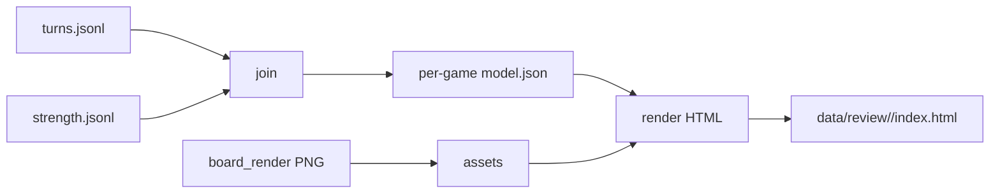

# 方案：赛后复盘视图原型

- **状态：** implemented（2026-10-05；验收 1–4 本机通过，验收 5 待所有者人工核）
- **任务：** P3-T5
- **作者 / 日期：** agent / 2026-10-05
- **相关：** ADR-0003、ADR-0012、[ADR-0013](../decisions/0013-offline-static-review-html.md)（accepted）；`design/P3-T1-strength-engine.md`、`design/P3-board-render.md`；`facts/standard-layer-import.md`、`facts/strength-cross-p3t0.md` §8

## 1. 目标与非目标

**目标：** 对任意一局已导入的配对局，生成可在浏览器打开的**赛后复盘页**：按回合时间线展示己方战力分位与置信度，并并列本场对手、实际战果、HDT 当场五率；点选回合可看双方阵容图。

| “做完”判据 | 说明 |
| --- | --- |
| 单局可打开 | CLI 对指定 `gameId` 产出 HTML（+ 相对路径资源），双击或 `file://` 可用 |
| 时间线完备 | 该局每个战斗回合一行：回合号、分位/区间/标签、对手英雄、胜平负+伤害、HDT 胜率 |
| 缺数诚实 | `insufficient` / `wide` / L1 放宽 / 非 `ready` 有可见文案，不伪装成精确分位 |
| 阵容可看 | 点选回合后显示己方+对手单侧 PNG（复用 P3-T6） |
| 验收可复跑 | §5 命令在本机对至少 1 局（建议 `ed11e0`）跑通 |

**非目标（本原型）：**

- 不做 HDT 覆盖层 / 局内显示（P4）。
- 不做方向选择 / 关键牌人工标注（愿景有，推迟到 P5 或 T5.x；预留可选 `notes.json` 口子即可）。
- 不做跨局对照仪表盘、群体统计图（那是 P3-T4 / 分析脚本）。
- 不重算分位、不跑模拟；只**消费**标准层 + `strength.jsonl` + 已渲好的阵容图。
- 不上传、不托管网页；输出默认在 `data/`（gitignore）。
- 不把 HDT 贴图打进 HTML 或仓库。

## 2. 依据

| 依据 | 对方案的约束 |
| --- | --- |
| roadmap P3-T5 | 「按回合展示分位、置信度、实际对手和结果」 |
| ADR-0003 / `strength-cross` §8 | 分位与 HDT 当场胜率**并列**；样本不足标不稳定；不声称替代本场匹配预测 |
| P3-T1 §3.10 | 消费 `data/strength/<bbVersion>/strength.jsonl` 行字段（`percentile`/`ci95`/`widthPts`/`level`/`flags`/`hdt`…） |
| 标准层 | 回合行已有 `turn`/`myHero`/`oppHero`/`result`/`damage`/`placement`/`resultSource`/`status`/`output` |
| ADR-0012 / P3-T6 | 阵容图调用方拼接两侧；本视图负责布局，不改 `render_side` |
| ADR-0013（accepted） | 交付形态 = 离线静态 HTML，无常驻服务 |
| 愿景 | 赛后重分析；不确定就明说 |

**依赖假设：**

| 假设 | 若不成立 |
| --- | --- |
| P3-T3 已产出可读的 `strength.jsonl`（主路径：己方 `side=Player`） | **硬依赖**：实现排在 T3 之后；不另开 mock 落地路径 |
| 标准层该局行存在且可按 `gameId`+`turn` 对齐 | 先跑 `tools.standard_layer` |
| P3-T6 可对同局出两侧 PNG | 视图在缺图时显示占位文案，不阻断整页 |

## 3. 方案

### 3.1 组件与数据流



新建包 `tools/review_view/`（结构对齐 `standard_layer` / `board_render`）：

| 文件 | 职责 |
| --- | --- |
| `join.py` | 按 `gameId` 对齐标准层回合 × 己方 strength 行；缺行填 `missing` |
| `boards.py` | 调 `board_render` 或复用已有 `data/boards/...`；写出相对路径清单 |
| `model.py` | 组装单局 `GameReview`（纯数据，无 HTML） |
| `page.py` | 模板 → 自包含程度足够的静态页（CSS/JS 内联） |
| `__main__.py` | CLI |
| `test_*.py` | join 规则、缺数文案、HTML 冒烟（合成 fixture，不依赖本机对局） |

### 3.2 单局数据模型

```python
@dataclass
class TurnReview:
    turn: int
    status: str                    # ready / partial / …
    opp_hero: str | None
    result: str | None             # win / tie / loss / …
    damage: int | None
    result_source: str | None
    # HDT 当场（来自 strength.hdt 或 turns.output）
    hdt_win: float | None
    hdt_tie: float | None
    hdt_loss: float | None
    # 战力（仅己方主路径）
    S: float | None
    percentile: float | None       # 0–1；展示时 ×100
    ci95: tuple[float, float] | None
    width_pts: float | None
    level: str | None              # L0 / L1 / insufficient / …
    flags: list[str]               # wide, …
    strength_state: str            # ok | wide | relaxed | insufficient | missing | non_ready
    my_tavern_tier: int | None     # 己方酒馆等级（开战 Input Player.Tier）
    opp_tavern_tier: int | None    # 对手酒馆等级（开战 Input Opponent.Tier）
    board_player: str | None       # 相对 index.html 的 png 路径
    board_opponent: str | None

@dataclass
class GameReview:
    game_id: str
    my_hero: str | None
    placement: int | None
    bb_version: str | None
    engine_version: str | None
    turns: list[TurnReview]
```

**对齐键：** `gameId` + `turn`；strength 只取 `side` ∈ {`Player`,`player`} 的主路径行。同一回合多 combat 时跟随标准层行（已按 combat 展开则各出一行）。

### 3.3 页面布局（单页）

```text
┌─────────────────────────────────────────────────────────┐
│ 局头：英雄 / 名次 / gameId / BB 版本 / 引擎版本           │
├─────────────────────────────────────────────────────────┤
│ 时间线（横轴=回合）：分位点 + 95% 误差棒；下方色条=战果   │
│ （hover / 点击选中回合）                                  │
├──────────────┬──────────────────────────────────────────┤
│ 回合详情     │ 己方 酒馆 T{n} + 阵容 PNG                 │
│ Q / CI / S   │ 对手 酒馆 T{n} + 阵容 PNG                 │
│ level·flags  │                                          │
│ 对手英雄     │                                          │
│ 实际结果+伤  │                                          │
│ HDT 五率     │                                          │
└──────────────┴──────────────────────────────────────────┘
```

双方酒馆等级与阵容图同区展示（各侧标题旁：`酒馆 Tn`）；缺数时写「酒馆 ?」，不臆造。

**来源（实现时）：** 开战 BB `_input` 的 `Player.Tier` / `Opponent.Tier`（= 英雄 `PLAYER_TECH_LEVEL`，见 `facts/bobsbuddy-simulator-input.md`）。标准层行若尚未透出该字段，由 `join`/`boards` 从该回合 `inputRef` 指向的 Input 读取；entities 仅作后备。

展示规则：

| `strength_state` | 时间线 | 详情文案 |
| --- | --- | --- |
| `ok` | 实心点 + 误差棒 | 「分位 xx%（95% CI …）」 |
| `wide` | 空心点 + 宽误差棒 | 同上 + 「区间偏宽，参考用」 |
| `relaxed` | 点旁 `L1` 标记 | 「已放宽：turn±1（或 level 原文）」 |
| `insufficient` | 灰叉 / 无分位点 | 「参照不足，仅有 S=…」或「无数」 |
| `missing` | 灰点 | 「尚无 strength 行（等 P3-T3 / 未入池）」 |
| `non_ready` | 灰点 | 「标准层非 ready：{status}」 |

HDT 五率始终单独一行，标签为「当场模拟」，与分位视觉分区，避免被读成同一指标。

### 3.4 CLI

```powershell
# 依赖：已有 turns.jsonl、strength.jsonl；可选先渲图
python -m tools.board_render --game ed11e0 --side both --out data\boards
python -m tools.review_view --game ed11e0 `
  --turns data\standard\turns.jsonl `
  --strength data\strength\1.85.0.0\strength.jsonl `
  --boards data\boards `
  --out data\review

# 调试：缺 strength 行时仍出页（不作为与 T3 并行的交付路径）
python -m tools.review_view --game ed11e0 --turns ... --allow-missing-strength --out data\review

# 批量：目录下全部 gameId
python -m tools.review_view --all --turns ... --strength ... --out data\review
```

输出：

```text
data/review/<gameId>/
  index.html
  model.json          # 便于调试 / 外部工具
  boards/             # 或相对链接到 --boards（默认复制或相对路径，实现时二选一并写清）
```

默认**不**起 HTTP 服务；需要时可用系统打开：`start data\review\ed11e0\index.html`。可选 `--serve`（stdlib `http.server`）仅方便本地点选，非验收必需。

### 3.5 与上下游边界

| 上游 | 本任务 | 下游 |
| --- | --- | --- |
| P3-T3 `strength.jsonl` | 只读 join | — |
| P2-T3 `turns.jsonl` | 只读 join | — |
| P3-T6 `render_side` | 调用或消费 PNG | — |
| — | 静态 HTML | 所有者浏览器复盘；P4 另开方案 |

不修改 strength 公式、不修改标准层 schema。若发现 join 缺字段，在方案实现记录里记缺口，回灌 T3 / 标准层另任务。

### 3.6 可选口子（不做实现）

`data/review/<gameId>/notes.json`：`{ "turns": { "7": { "direction": "...", "note": "..." } } }`。原型 HTML 若文件存在可只读展示；无文件不报错。方向复盘产品化留给 P5。

## 4. 考虑过的替代方案

| 方案 | 优点 | 缺点 | 结论 |
| --- | --- | --- | --- |
| **离线静态 HTML** | 零依赖打开；可归档；与现有 `tools/` CLI 一致 | 交互弱于应用 | **选中**（ADR-0013） |
| Streamlit / Gradio | 交互快 | 多依赖、常驻进程、难归档单局快照 | 不选 |
| Jupyter | 分析灵活 | 不是「打开即复盘」产品形态 | 分析脚本可另用，不做本任务交付 |
| HDT WPF 窗口 | 与游戏一体 | 属 P4；改插件面大 | 不选 |
| 纯 Markdown/PNG 报告 | 实现极简 | 时间线与点选差 | 可作调试导出，不作主交付 |

## 5. 验收方式

| # | 验收项 | 怎么跑 | 通过标准 |
| --- | --- | --- | --- |
| 1 | 单元测试 | `python -m unittest discover -s tools\review_view -p "test_*.py" -v` | join：对齐键、缺 strength、non_ready、wide/L1 文案；fixture HTML 含关键字段 |
| 2 | 单局冒烟 | 对 `ed11e0`（或当前配对局）生成 `index.html` | 文件存在；`model.json` 回合数 = 标准层该局战斗行数 |
| 3 | 有 strength 时 | T3 产出后重跑同局 | 每个 `ready` 己方回合：有分位或显式 `insufficient`/`missing`；无「空着当 0」 |
| 4 | 阵容 | 预渲或 CLI 内触发两侧图 | 点选 ≥3 个回合可见双方随从图（或明确缺图占位）；两侧标题旁有酒馆等级（或「?」） |
| 5 | 人工核对 | 所有者打开 1 局，对照团子/标准层 | 对手英雄、战果、伤害、名次一致；分位旁能看到 HDT 胜率；宽区间/放宽可辨 |

P3 总退出标准不由 T5 单独承担；T5 只证明「人能用这些数复盘」。

## 6. 风险与回退

| 风险 | 回退 |
| --- | --- |
| P3-T3 未完成，无真实分位 | **不落地**；等 T3。单元测试可用合成 fixture，但不作为产品冒烟交付 |
| `file://` 下相对路径 / 浏览器限制 | 文档改用 `start` 或可选 `--serve` |
| 肖像/chrome 缺失导致图丑 | 沿用 T6 回退；视图不阻断 |
| 时间线库过重 | 纯 SVG/Canvas 自绘点与误差棒，不引入前端构建链 |
| 愿景要求的「标注」缺失导致不好用 | notes 口子；所有者确认后再做编辑 UI |

## 7. 任务拆分

| 步骤 | 内容 | 单独验证 |
| --- | --- | --- |
| T5.0 ✅ | 本方案 + ADR-0013 所有者审阅 | approved / accepted（2026-10-05） |
| T5.1 ✅ | `join.py` + `model.py` + 单元测试 | 验收 1：11 unittest |
| T5.2 ✅ | `page.py` 时间线 + 详情 | fixture HTML；验收 2 |
| T5.3 ✅ | 接入 `board_render` / 酒馆等级 | 验收 4：ed11e0 两侧图 + Tier |
| T5.4 ⏳ | 真实 strength 联调 + 所有者人工核 | 验收 3 本机通过；**验收 5 待所有者** |

## 8. 实现记录

- 包：`tools/review_view/`（`join` / `model` / `boards` / `page` / CLI）。模块不用名 `html.py`（与标准库冲突 → `page.py`）。
- 样本：`data/review/20261005_104908_ed11e0/`（gitignore）；12 回合全部 `ready` 均有分位或 `wide`；T5 己方酒馆 4 / 对手 3。
- 阵容图默认从 `--boards` **复制**进 `data/review/<gameId>/boards/`，便于 `file://` 打开。
- P3 退出标准第 1 条未达标不影响本视图消费 `strength.jsonl`。
