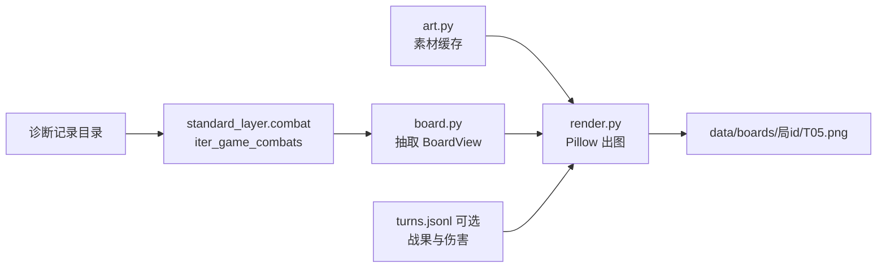

# 方案：局面阵容图离线渲染

- **状态：** review
- **任务：** P3-T6（新增；P3-T5 复盘视图的组件，可先于 T5 单独交付）
- **作者 / 日期：** agent / 2026-10-05
- **相关：** `facts/hdt-past-opponent-board-render.md`、`facts/standard-layer-import.md`、`facts/diag-tuanzi-compat-20261004.md`、`facts/licensing.md`、ADR-0006、ADR-0010

## 1. 目标与非目标

**目标：** 给诊断记录里的任意一场战斗，离线生成一张 PNG 局面图，信息量不低于 HDT 悬停头像时显示的“上次对手阵容条”。

| 图中元素 | 内容 |
| --- | --- |
| 两排随从 | 上排对手、下排己方，按场上顺序；每个随从画圆形肖像、攻/血数字、金色边框 |
| 关键词角标 | 嘲讽、圣盾、亡语、复生、剧毒、毒液；另加 HDT 没画的风怒、潜行 |
| 标题行 | 回合、双方英雄（中文名 + 头像）、HDT 当场五率（胜/平/负）、实际战果与伤害（有则显示） |

“做完”的判据：§5 的验收全部通过；能用一条命令为一局的全部战斗出图。

**非目标：**

- 不画附魔细则、手牌、奥秘、饰品、英雄技能、神祇、三连统计（v1 不画；数据在 dump 里，以后需要再加）。
- 不在 HDT 里显示，不做实时叠加层（那是 P4）。
- 不复制、不再分发 HDT 的贴图（`Resources/Minion/*.png`）；边框和角标自己画。
- 不做双人模式（数据结构留口子，渲染不处理队友场面）。

## 2. 依据

| 依据 | 对方案的约束 |
| --- | --- |
| `hdt-past-opponent-board-render` §2.1 | 每场 `entities@combat_start` 与 HDT `BoardSnapshot` 同构，样本回合与 BB `Side` 一一对齐 → **首选数据源** |
| 同上 §2.2 | BB `Side.items` 没有亡语字段，金色随从的 `CardID` 不带 `_G` → 只作**后备**（开战快照缺失时用） |
| 同上 §3 + 本次实测 | HSJSON 的随从 256x 肖像（含 `_G` 金色版）和英雄头像 `heroes/latest/256x/{id}.png` 直连均返回 200；本机 HDT 缓存 `Images/CardPortraits` 有约 222 张；卡牌 JSON 见 §3.7 |
| `standard-layer-import` | `tools.standard_layer.combat.iter_game_combats` 已经把每场战斗切好，并带 `entities`、`input`、`output`、英雄名 → 渲染器直接复用，不重写解析 |
| `licensing` / ADR-0006 | HDT 资源属专有内容 → 自绘图形；卡图来自 HSJSON（暴雪版权，只在本地缓存，不入库） |
| 隐私规则（AGENTS.md §6.5） | 图里只画卡牌和英雄，不写 BattleTag；输出放在 `data/` 下（已 gitignore） |
| 本机环境 | Python 3.10 + Pillow 10.4 已装；`C:\Windows\Fonts\msyh.ttc` 可画中文英雄名 |

没有未决问题卡住本方案。

## 3. 方案

### 3.1 组件



新建包 `tools/board_render/`：

| 文件 | 职责 |
| --- | --- |
| `board.py` | 把一场战斗转换成 `BoardView`；不碰网络和图像 |
| `art.py` | 按 CardId 取肖像：先查本地缓存，再查 HDT 缓存（只读），再从 HSJSON 下载；都失败就返回 `None` |
| `cards.py` | 读卡牌库，只提供基础攻血（§3.7） |
| `render.py` | 根据 `BoardView` 和素材画 PNG；布局常量集中放在文件开头 |
| `__main__.py` | 命令行入口 |
| `test_board.py` / `test_render.py` | 单元测试（使用手写的小样本，不依赖本机数据） |

### 3.2 数据结构

```python
@dataclass
class MinionView:
    card_id: str          # 用于取图；金色时为 *_G
    base_card_id: str     # 去掉 _G 后的基卡 id，用于对照
    attack: int
    health: int           # HEALTH - DAMAGE（开战时通常 DAMAGE=0）
    golden: bool
    taunt: bool
    divine_shield: bool
    deathrattle: bool
    reborn: bool
    poisonous: bool
    venomous: bool
    windfury: bool
    stealth: bool
    position: int         # 场上位置，从 1 开始

@dataclass
class BoardView:
    game_id: str
    combat: int
    turn: int | None
    source: str           # "entities" | "input"
    my_hero: tuple[str | None, str | None]    # (中文名, CardId)
    opp_hero: tuple[str | None, str | None]
    my_minions: list[MinionView]
    opp_minions: list[MinionView]
    win_tie_loss: tuple[float, float, float] | None   # HDT 当场五率中的胜/平/负
    result: str | None    # 来自 turns.jsonl；没有就留空
    damage: int | None
```

### 3.3 抽取规则（`board.py`）

1. **开战快照 `entities`（首选）：** 取 `context.player.board` / `context.opponent.board` 里的实体，只留 `CARDTYPE=4`（随从）且 `ZONE=1`，按 `ZONE_POSITION` 排序。字段对应关系：`ATK`、`HEALTH−DAMAGE`、`PREMIUM`、`TAUNT`、`DIVINE_SHIELD`、`DEATH_RATTLE`、`REBORN`、`POISONOUS`、`VENOMOUS`、`WINDFURY`、`STEALTH`；卡牌 id 用 `info.LatestCardId`，为空时退回 `cardId`。
2. **BB 输入（后备）：** 开战快照不存在、或某一方随从数为 0 但 BB 输入里有随从时使用。`CardID` + `_data.MaxAttack/MaxHealth/Golden/Taunt/Div/Reborn/Poisonous/Venomous/Windfury/Stealth`；金色时取图用 `CardID + "_G"`；亡语一律记为 `False`，并在图上用小字标注“来源：BB 输入”。
3. **标题数据：** 英雄名取 `_playerHeroName` / `_opponentHeroName`，英雄 CardId 取 `myHeroCard` / `oppHeroCard`；五率取 `output.winRate/tieRate/lossRate`；只有传了 `--turns` 时才读 `turns.jsonl` 的 `result` / `damage`。
4. 幽灵对手（英雄 CardId 含 `KelThuzad`）照常出图，标题加“幽灵”标记。

### 3.4 素材缓存（`art.py`）

| 顺序 | 位置 | 说明 |
| --- | --- | --- |
| 1 | `data/art_cache/portraits/{id}.jpg`、`data/art_cache/heroes/{id}.png` | 本项目自己的缓存，已被 gitignore |
| 2 | `%APPDATA%\HearthstoneDeckTracker\Images\CardPortraits\{id}.jpg` | HDT 的缓存，**只读**，命中后复制到本地缓存 |
| 3 | `https://art.hearthstonejson.com/v1/256x/{id}.jpg`、`.../heroes/latest/256x/{id}.png` | 下载超时 10 秒，单线程，同一次运行中失败过的 id 不再重试 |

- 金色随从先找 `{id}_G`，没有再退回基卡 id（画面上仍画金色边框）。
- 加 `--offline` 参数时跳过第 3 步。取不到的图画成灰色圆，中间写 CardId；统计数量写进运行摘要。

### 3.5 布局（`render.py`）

- 画布固定 1280×560，深色背景（参考 HDT 的 `#202427`）。
- 标题行高 80：左边是对手英雄头像 + 名字，右边是己方英雄头像 + 名字，中间写 `T5 · 胜 53.3% / 平 6.1% / 负 40.6% · 实际：赢 4`。
- 对手一排、己方一排，每排最多 7 个随从，水平居中；每个随从格 150×200。
- 随从格的画法：椭圆裁剪的肖像；外圈边框（普通为灰色，金色为金黄色）；左下角画攻击、右下角画生命（白字黑描边，比卡面基础值高时用绿色，和 HDT 一致；基础值见 §3.7，取不到就一律白色）；关键词用格子上方一排小圆角标签（“嘲”“盾”“亡”“生”“毒”“液”“风”“潜”），不去模仿游戏内特效。
- 字体：`msyh.ttc`；找不到时用 Pillow 自带字体，并给出警告。

### 3.6 命令行

```powershell
python -m tools.board_render --game ed11e0 --out data\boards
python -m tools.board_render --game ed11e0 --turn 5 --out data\boards --turns data\standard_paired7\turns.jsonl
python -m tools.board_render --game ed11e0 --offline --out data\boards
```

- `--game` 匹配局 id 后缀，和 `standard_layer` 的用法一致。
- 输出文件：`{out}\{gameId}\T{turn:02d}_c{combat}.png`，另写一份 `summary.json`（每张图的来源、随从数、缺图数）。

### 3.7 卡牌基础攻血（用于绿色高亮）

在 `art.py` 旁边加一个只读的卡牌库读取器（`cards.py`），只用来取基础攻血；拿不到就不做绿色高亮，其他照常画。不引入 HearthDb.dll。

| 顺序 | 来源 | 本机实测（2026-10-05） |
| --- | --- | --- |
| 1 | `data/art_cache/cards.zhCN.json` | 本项目缓存 |
| 2 | HDT 的 `%APPDATA%\HearthstoneDeckTracker\CardDefs\CardDefs.*.xml`（`CardDefsManager.cs:24–40` 的路径，只读） | 本机**没有**这个目录 |
| 3 | `https://api.hearthstonejson.com/v1/latest/zhCN/cards.json`（约 10 MB） | 直连超时；走本机代理 `127.0.0.1:1081` 返回 200 |

下载代码沿用环境变量 `https_proxy`（与 AGENTS.md §7 的代理用法一致）。卡图域名 `art.hearthstonejson.com` 本机直连就能访问。这份 JSON 还带中文卡名，以后需要在随从下方加名字时可以直接用。

## 4. 考虑过的替代方案

| 方案 | 不选的原因 |
| --- | --- |
| 在 HDT 进程里写插件，复用 `BattlegroundsMinion` 控件，用 WPF `RenderTargetBitmap` 截图 | 必须开着 HDT；控件绑定 `Core.Game` 的实时实体，我们的 dump 要先还原成 `Entity`；依赖 HDT 内部类型，升级容易坏；复盘时 HDT 不一定在运行 |
| 生成 HTML/SVG，直接引用 HSJSON 的图片链接 | 不是独立文件，查看时必须联网，也不好嵌到报告或聊天里；以后做 P3-T5 网页复盘时可以复用 `BoardView`，再考虑 |
| 单独的 C# WPF 离线渲染程序 | 要另建工程、调 WPF 无头渲染，比 Python + Pillow 重；现有离线工具链都是 Python |
| 只用 BB 输入不用开战快照 | 缺亡语、金色 id 要猜；开战快照本来就有，而且与 HDT 的显示同源 |

## 5. 验收方式

| # | 验收项 | 怎么跑 | 通过标准 |
| --- | --- | --- | --- |
| 1 | 抽取单元测试 | `python -m unittest discover -s tools\board_render -p "test_*.py" -v` | 手写小样本覆盖：排序、金色 `_G`、关键词、`DAMAGE` 扣血、后备路径、幽灵标记 |
| 2 | 两种来源一致性 | `python -m tools.board_render --check --game …`（配对 7 局） | 同时有开战快照和 BB 输入的 `ready` 战斗中，双方 (基卡 id, 攻, 血, 金色, 嘲讽, 圣盾) 的列表**顺序与内容 100% 一致**；不一致逐条列出 |
| 3 | 出图冒烟 | 对 `ed11e0` 全局出图 | 每场战斗 1 张 PNG，尺寸 1280×560；`summary.json` 中缺图数在联网时为 0 |
| 4 | 离线模式 | 预热缓存后加 `--offline` 再跑一次 | 不发网络请求，输出与第 3 项逐像素一致 |
| 5 | 人工核对 | 所有者挑 3 张图，对照团子对战记录（或对局时 HDT 悬停截图） | 随从、顺序、攻血、金色与记录一致；关键词无漏画 |

## 6. 风险与回退

| 风险 | 回退 |
| --- | --- |
| HSJSON 不可用或某张新卡还没有图 | 用 HDT 缓存；再不行画占位圆 + CardId，不影响其他元素 |
| 开战快照里某些变形随从的 `LatestCardId` 与显示不一致 | 一致性检查（验收 2）会暴露出来；必要时改为与 BB 输入的 `CardID` 对齐 |
| 自绘角标不如 HDT 好看 | v1 以信息正确为准；以后可让所有者在本机指定 HDT 资源目录作为可选皮肤（不入库） |
| 战斗中才揭示的信息（如对手奥秘）不在开战快照里 | v1 不画奥秘；阵容条与 HDT 一样只反映开战瞬间 |

## 7. 任务拆分

| 步骤 | 内容 | 单独验证 |
| --- | --- | --- |
| T6.1 | `board.py` + `test_board.py` + `--check` 一致性报告 | 验收 1、2 |
| T6.2 | `art.py` + `cards.py`（三级缓存、离线模式、基础攻血） | 小测试：缓存命中顺序、离线不联网、卡牌库缺失时不报错 |
| T6.3 | `render.py` + `__main__.py` + `summary.json` | 验收 3、4 |
| T6.4 | 所有者人工核对 + 补事实文档 + 更新 status/roadmap | 验收 5 |
