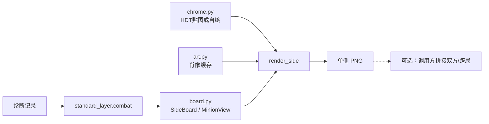

# 方案：局面阵容图离线渲染

- **状态：** implemented（2026-10-05；验收 5 所有者确认通过）
- **任务：** P3-T6（新增；P3-T5 复盘视图的组件，可先于 T5 单独交付）
- **作者 / 日期：** agent / 2026-10-05
- **相关：** ADR-0012、`facts/hdt-past-opponent-board-render.md`、`facts/standard-layer-import.md`、`facts/licensing.md`、ADR-0006、ADR-0010

## 1. 目标与非目标

**目标：** 提供无状态的**单侧随从横排**渲染单元：给定一侧场面数据，离线画出一张 PNG，随从信息量不低于 HDT 悬停头像时阵容条上的单个随从（肖像、攻血、金色、关键词角标）。

| 图中元素（v1） | 内容 |
| --- | --- |
| 一排随从 | 按场上顺序；每个：圆形肖像、攻/血、金色边框、关键词角标 |
| 关键词 | 嘲讽、圣盾、亡语、复生、剧毒、毒液；另加 HDT 控件未画的风怒、潜行（有贴图用贴图，否则自绘字标） |

“做完”的判据：§5 验收通过；核心库能对任意一侧 `list[MinionView]` 出图；CLI 能从诊断记录抽出己方或对手侧并批量出图。

**非目标（v1）：**

- 不在图上画英雄、五率、战果、附魔细则、手牌、奥秘、饰品、英雄技能、神祇、三连（可后续解耦；数据抽取可先保留在 `board.py` 供上层用，但不进 `render_side`）。
- 不把「双方并排 / 跨局对战」绑进核心 API；需要时由调用方对两侧各渲一次再拼接。
- 不在 HDT 里显示，不做实时叠加层（P4）。
- 不把 HDT 贴图复制进仓库或随项目分发（本机只读，见 ADR-0012）。
- 不做双人队友场面（数据结构可留口子）。

## 2. 依据

| 依据 | 对方案的约束 |
| --- | --- |
| ADR-0012 | 单侧无状态单元；本机 HDT 贴图优先；v1 只画随从 |
| `hdt-past-opponent-board-render` §2.1 | `entities@combat_start` 与 HDT `BoardSnapshot` 同构 → **首选抽取源** |
| 同上 §2.2 | BB `Side.items` 无亡语字段、金色 `CardID` 常无 `_G` → **后备** |
| 同上 §3 | HSJSON 肖像可达；HDT `CardPortraits` 可只读复用；边框/角标在 HDT `Resources/Minion/*.png`（`App.xaml:47–59`） |
| `standard-layer-import` | 复用 `iter_game_combats`，不重写战斗切分 |
| `licensing` / ADR-0006 | 本机个人非商业可读 HDT 资源；**不入库、不分发** |
| 本机环境 | Python 3.10 + Pillow 10.4；`msyh.ttc` 可用 |

## 3. 方案

### 3.1 组件



新建包 `tools/board_render/`：

| 文件 | 职责 |
| --- | --- |
| `board.py` | 从一场战斗抽出一侧或多侧的 `list[MinionView]`；不碰网络和图像 |
| `art.py` | 随从肖像：本地缓存 → HDT CardPortraits（只读）→ HSJSON |
| `chrome.py` | 边框/角标：探测本机 HDT 资源或 `--chrome-dir`；失败则自绘 |
| `cards.py` | 可选：基础攻血（绿色高亮）；取不到则白字 |
| `render.py` | `render_side(minions, …) → Image`；布局常量集中在文件头 |
| `__main__.py` | CLI：按局/回合/侧批量出图；可选 `--compose both` 做简单上下拼接（非核心） |
| `test_*.py` | 手写样本；不依赖本机对局数据 |

### 3.2 数据结构

```python
@dataclass
class MinionView:
    card_id: str          # 取图用；金色优先 *_G
    base_card_id: str
    attack: int
    health: int           # HEALTH - DAMAGE
    golden: bool
    taunt: bool
    divine_shield: bool
    deathrattle: bool
    reborn: bool
    poisonous: bool
    venomous: bool
    windfury: bool
    stealth: bool
    position: int         # 从 1 起

@dataclass
class SideBoard:
    """无状态单侧场面；不绑定己方/对手语义。"""
    minions: list[MinionView]
    source: str           # "entities" | "input"
    label: str | None = None   # 仅元数据，默认不画进图
```

核心渲染签名：

```python
def render_side(side: SideBoard, *, art: ArtStore, chrome: ChromeStore) -> Image.Image: ...
```

CLI / 上层若要「本场对手」「跨局 A vs B」，各自构造两个 `SideBoard` 再决定是否拼接。

### 3.3 抽取规则（`board.py`）

1. **开战快照 `entities`（首选）：** `context.<side>.board` 中 `CARDTYPE=4` 且 `ZONE=1`，按 `ZONE_POSITION` 排序。标签：`ATK`、`HEALTH−DAMAGE`、`PREMIUM`、`TAUNT`、`DIVINE_SHIELD`、`DEATH_RATTLE`、`REBORN`、`POISONOUS`、`VENOMOUS`、`WINDFURY`、`STEALTH`；卡牌 id 用 `info.LatestCardId`，否则 `cardId`。
2. **BB 输入（后备）：** 快照缺失或该侧随从为空但 Input 有随从时。`CardID` + `_data` 的 Max 攻血与关键词；金色取图 `CardID+"_G"`；`deathrattle=False`（无法从 Input 可靠得到）。
3. CLI 的 `--side player|opponent|both` 只影响「从哪一侧抽取 / 是否各渲一张」，不改变 `render_side`。

### 3.4 肖像（`art.py`）

| 顺序 | 位置 |
| --- | --- |
| 1 | `data/art_cache/portraits/{id}.jpg` |
| 2 | `%APPDATA%\HearthstoneDeckTracker\Images\CardPortraits\{id}.jpg`（只读，命中后可复制到本地缓存） |
| 3 | `https://art.hearthstonejson.com/v1/256x/{id}.jpg`（`--offline` 跳过） |

缺图：灰色圆 + CardId；计入 `summary.json`。

### 3.5 边框与角标（`chrome.py`）

| 顺序 | 来源 |
| --- | --- |
| 1 | `--chrome-dir`（若指定）下的 PNG，文件名对齐 HDT：`border.png`、`border_premium.png`、`taunt.png`、`taunt_premium.png`、`divine-shield.png`、`deathrattle.png`、`reborn.png`、`poisonous.png`、`venomous.png`、`stats.png`、`stats_premium.png` 等（见 `App.xaml:47–59`） |
| 2 | 本机已安装 HDT 目录内可解析到的同名资源（Squirrel `app-*` 或从 exe 旁探测；实现时写清探测顺序） |
| 3 | 自绘回退（灰/金椭圆边框 + 短字标签） |

**禁止**把这些 PNG 写入 git。文档与 `--help` 注明：仅本机个人使用。

### 3.6 布局（`render_side`）

- 单行画布：高度固定（约 200–220），宽度随随从数伸缩（每格约 150，最多 7，可加左右边距）；深色底 `#202427`。
- 随从格：椭圆裁剪肖像；叠 chrome 边框/角标；左下攻、右下血（相对卡面基础值偏高时绿色，见 §3.8）。
- 默认**不**画标题、英雄、五率。

### 3.7 命令行

```powershell
python -m tools.board_render --game ed11e0 --side opponent --out data\boards
python -m tools.board_render --game ed11e0 --side player --turn 5 --out data\boards
python -m tools.board_render --game ed11e0 --side both --compose --out data\boards
python -m tools.board_render --game ed11e0 --offline --chrome-dir D:\path\to\Minion --out data\boards
python -m tools.board_render --check --game ed11e0
```

- `--side both`：每场战斗输出两张（`…_player.png` / `…_opponent.png`）；加 `--compose` 时再额外写一张上下拼接图（便利，非验收核心）。
- 输出：`{out}\{gameId}\T{turn:02d}_c{combat}_{side}.png` + `summary.json`。

### 3.8 卡牌基础攻血（可选绿色高亮）

同前：`cards.py` 读 `data/art_cache/cards.zhCN.json` → 可选 HDT CardDefs → HSJSON（可走 `https_proxy`）。失败则攻血一律白字。

## 4. 考虑过的替代方案

| 方案 | 不选的原因 |
| --- | --- |
| 固定双方 + 标题元数据一张图 | 所有者要求单侧单元以支持跨局组合（ADR-0012） |
| 只仿 HDT 画对手 | 无法画己方/跨局 |
| 永远自绘 chrome | 所有者允许本机 HDT 贴图 |
| 进程内复用 WPF `BattlegroundsMinion` | 依赖运行中的 HDT 与实时 Entity |
| v1 就画英雄/五率/战果 | 所有者要求与随从解耦，后续再加 |

## 5. 验收方式

| # | 验收项 | 怎么跑 | 通过标准 |
| --- | --- | --- | --- |
| 1 | 抽取单元测试 | `python -m unittest discover -s tools\board_render -p "test_*.py" -v` | 排序、金色 `_G`、关键词、`DAMAGE`、后备路径 |
| 2 | 两种来源一致性 | `python -m tools.board_render --check --game …`（配对局） | 同场同侧 entities vs BB：`(基卡 id, 攻, 血, 金色, 嘲讽, 圣盾)` 列表 100% 一致 |
| 3 | 单侧出图冒烟 | `ed11e0`、`--side opponent`（及 `player`） | 每场每侧 1 张 PNG；联网时肖像缺图数为 0（或仅文档注明的未知卡） |
| 4 | 离线 + chrome | 预热肖像后 `--offline`；有/无 `--chrome-dir` 各跑一次 | 离线不联网；无 chrome 时仍出图（自绘回退） |
| 5 | 人工核对 | 所有者挑 ≥3 张单侧图，对照团子阵容或 HDT 悬停 | 随从、顺序、攻血、金色、可见关键词一致 |

## 6. 风险与回退

| 风险 | 回退 |
| --- | --- |
| 找不到 HDT 贴图（嵌入 exe、路径因版本变） | 自绘；接受观感差距 |
| HSJSON / 肖像缺失 | 占位圆；不阻断批量 |
| entities 与 BB 卡牌 id 不一致 | `--check` 暴露；必要时取图优先 BB `CardID`+`Golden` |
| 拼接双方的边距/比例不满意 | 调整仅在调用方 / `--compose`，不动 `render_side` 契约 |

## 7. 任务拆分

| 步骤 | 内容 | 单独验证 |
| --- | --- | --- |
| T6.1 ✅ | `board.py` + `test_board.py` + `--check` | 验收 1、2：12 unittest；ed11e0 `--check` 24/24 |
| T6.2 ✅ | `art.py` + `chrome.py` + `cards.py` | 缓存顺序、offline、无 chrome 回退 |
| T6.3 ✅ | `render_side` + CLI（含可选 `--compose`） | 验收 3、4：ed11e0 缺图 0；offline / drawn 均可出图 |
| T6.4 ✅ | 所有者人工核对；更新 status/roadmap | 验收 5：所有者 2026-10-05 确认没问题 |

## 8. 实现记录

- 分支：`feat/P3-T6-board-render`；包：`tools/board_render/`。
- `analyze_combat` 增补 `context`（含 `<side>.board` id），供 entities 抽取；不改变原有字段语义。
- HDT 安装包内 `Resources/Minion` 多为嵌入资源、无松散 PNG；探测顺序：`--chrome-dir` → Squirrel `app-*/Resources/Minion` → 本机源码检出 `…/Resources/Minion`（本机常命中）→ 自绘。**不入库、不分发。**
- 风怒 / 潜行：HDT 控件无对应贴图，一律自绘字标。
- 样本出图：`data/boards/20261005_104908_ed11e0/`（gitignore）；`summary.json` 记 `missingPortraitCount` / `chromeSource` / `cardsSource`。
