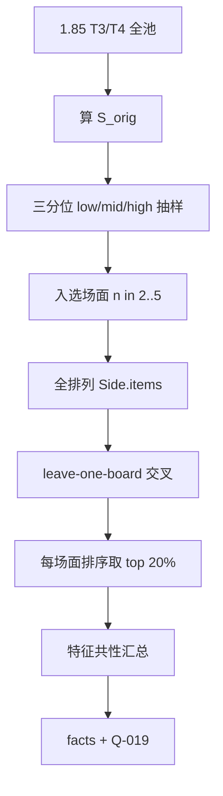

# 方案：抽样全排列最优站位与共性总结（主线外）

- **状态：** implemented（2026-10-07；结论见 `facts/positioning-enumerate.md`；与方案无重大偏差）
- **任务：** 主线外研究；交付 `spikes/positioning/` 扩展；问题编号 **Q-019**
- **作者 / 日期：** agent / 2026-10-07
- **相关：** `facts/positioning-strength.md`、`facts/positioning-keyword.md`；Q-017/Q-018；ADR-0003

## 1. 目标与非目标

**要回答：**

1. 在 **T3 / T4**（随从少、\(n!\) 可穷尽）上，对按 \(S_{\mathrm{orig}}\) 分层抽样的少量场面，**全排列**相对同回合对手池的 \(S\) 分布如何？原序落在什么分位？
2. 每个抽样场面取 **同阵容** 下得分最高的前 **20%** 排列，这些「头部站位」在关键词/身材相对序上有哪些**可复述的共性**？
3. 若共性稳定，是否值得再做成规则或搜索提示；若不稳，关闭为「暂无可产品化口诀」。

**非目标**

- 不做 T5+ 全排列；不进 P4 / UI；不改 `tools/strength` 正式管线。
- 不以「对本场匹配」或名次为主指标（仍用 leave-one-board 大厅池 \(S\)）。
- 不做无预算的大搜（本轮 = 真全排列，受 \(n_{\max}\) 约束）。

## 2. 依据

| 依据 | 用法 |
| --- | --- |
| Q-017 / Q-018 | 固定规则无 CI+；邻交换爬山有同池乐观增益 → 需看「真头部排列」长什么样 |
| 本机 1.85 规模（2026-10-07） | T3：\(n\le4\)（多数 2–3）；T4：有 \(n=5\sim7\)，须截断 |
| R-positioning 框架 | 同 BB、同池、`iterations=500`、复用 cache / ReplaySim |

**假设**

| # | 假设 | 若不成立 |
| --- | --- | --- |
| H1 | \(n\in[2,5]\) 的场面足够覆盖低/中/高 \(S\) 层 | 某层凑不够则降 `per_stratum` 或放宽到 \(n=6\) 仅 1 个试点 |
| H2 | 按 item 下标全排列（多重集）即可；不合并「等价身材」 | 若 \(n=5\) 过多重复 CardID，报告中注明有效相异序更少 |
| H3 | 头部 20% 的特征频率相对全体排列 / 相对底部 20% 可对照 | 仅描述统计，不做强显著性宣称（样本场面少） |

## 3. 方案



### 3.1 样本与分层（默认）

| 项 | 默认 |
| --- | --- |
| BB | `1.85.0.0` |
| 回合 | **3, 4** |
| 对手池 | 该回合**全体** ready 双侧场面；评估剔同 `boardId` |
| \(S_{\mathrm{orig}}\) | 与既往 spike 相同公式；可复用已有 cache |
| 分层 | 按该回合池内 \(S_{\mathrm{orig}}\) **三分位**（low / mid / high） |
| 每层抽样 | **`per_stratum=2`** → 每回合最多 **6** 场面；种子 `enumerate-2026-10-07` |
| 随从数 | **\(n\in[2,5]\)** 才可入选；\(n\le1\) 跳过；\(n\ge6\) **不进默认全排列** |
| 若某层合格场面 &lt; 2 | 能抽几个抽几个，并在 summary 记 `shortfall` |

**成本上界（默认）：** 最坏 12 场面 × \(5!=120\) × ~61 对手 ≈ **8.8e4** 对；实测 Q-017 ~6e4 对约 17 min 模拟 → 预期全进程 **≤ 1–2 h**（大量 cache 命中更短）。硬顶：全局 pair **1.5e5**；超出则停并记截断场面。

### 3.2 全排列与头部

- 对入选场面候选侧 `items`，枚举全部下标排列（`itertools.permutations`）。
- 每个排列算 \(S\)；记录 `rank`、`percentile`、相对 `S_orig` 的 \(\Delta S\)、相对最优的 gap。
- **头部集：** 同场面内按 \(S\) 降序，取前 \(\lceil 0.2\cdot n!\rceil\)（至少 1）；并列边界整段纳入并记 `topExpanded`。

### 3.3 共性特征（可解释、可计数）

对每个排列导出特征向量（相对该场面**原多重集**，不依赖绝对 CardID 也能跨场面聚合）：

| 特征族 | 例子 |
| --- | --- |
| 关键词槽位 | 嘲讽是否在 index 0 / 最左嘲讽下标；复生平均下标；裂解邻是否有更高血 |
| 身材序 | Spearman：站位序 vs 攻降序 / 血降序；最强攻/血是否靠左半 |
| 与原序 | Kendall τ / 邻交换距离（相对 orig） |
| 相对最优 | 是否等于 max；\(\Delta S_{\mathrm{best}}-\Delta S\) |

跨场面汇总：

1. **头部 vs 全体**：各特征在 top20% 的均值/比例 − 全体基线。
2. **头部 vs 底部 20%**：同特征差分（对照噪声）。
3. 分回合、分 \(S\) 层各出一小节；再给「T3+T4 合并」表。
4. 人工可读：每个抽样场面列出 **最优序 vs 原序** 的 CardID 序列 + \(S\)。

**成功读出：** 至少 2 个特征在「头部 − 底部」上同方向、且多数抽样场面一致（例如 ≥2/3 场面头部更常「嘲讽靠左」）。否则结论写「无可复述共性」。

### 3.4 输出

`data/positioning/1.85.0.0/enumerate/`：

| 文件 | 内容 |
| --- | --- |
| `sample.json` | 入选场面、分层、\(n\)、\(S_{\mathrm{orig}}\) |
| `perms.jsonl` | 每排列一行（boardId, permId, order, S, …） |
| `top.jsonl` | 仅头部 20% |
| `features.json` | 共性汇总表 |
| `summary.json` | 成本、截断、原序分位分布、结论摘要字段 |

### 3.5 CLI

```powershell
python -m spikes.positioning enumerate --bb-version 1.85.0.0 --turns 3,4
python -m spikes.positioning enumerate --dry-run   # 只抽样+估 pair
```

## 4. 考虑过的替代方案

| 方案 | 为何不选（本轮） |
| --- | --- |
| 全池全排列 | T4 \(n=7\) 单场面 ~3e5 对，过贵 |
| 只抽中位场面 | 所有者要求覆盖低/中/高 |
| 合并等价序（同攻血） | 实现复杂；先全枚举再在报告里注相异度 |

## 5. 验收方式

| # | 项 | 标准 |
| --- | --- | --- |
| 1 | 单测 | 分层抽样稳定；\(n=3\) 枚举 6 序；top20% 个数正确 |
| 2 | dry-run | 打印每层入选与估 pair，无模拟 |
| 3 | 冒烟 | T3 `per_stratum=1` 跑通，`nMissing=0` |
| 4 | 全量 | T3+T4 默认参数；`summary` + `features` 落盘 |
| 5 | 文档 | facts + Q-019 关闭或降级；worklog |

## 6. 风险与回退

| 风险 | 缓解 |
| --- | --- |
| 高 \(S\) 层合格 \(n\) 不足 | shortfall 记录；不硬凑 \(n\ge6\) |
| 共性过拟合 12 场面 | 只写描述性结论；标样本小 |
| pair 爆 | 硬顶 1.5e5；优先保证每层至少 1 个 \(n\le4\) |

## 7. 任务拆分

1. 方案 + Q-019  
2. `enumerate` 模块（抽样 / 排列 / 特征）+ CLI  
3. 冒烟 → 全量 → facts / status / worklog  
