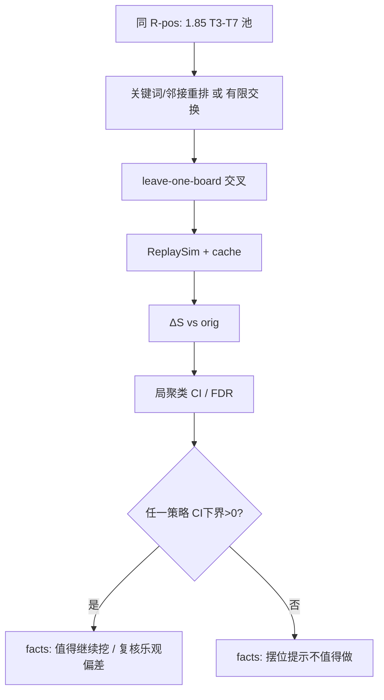

# 方案：关键词 / 邻接感知摆位对 \(S\) 的增量（主线外）

- **状态：** implemented（2026-10-07；结论见 `facts/positioning-keyword.md`；与方案无重大偏差；H3 留出复核未做）
- **任务：** 主线外研究（非 P3/P4）；承接 Q-017；交付在 `spikes/positioning/` 扩展
- **作者 / 日期：** agent / 2026-10-07
- **相关：** `facts/positioning-strength.md`；`design/R-positioning-strength.md`（已 implemented）；ADR-0003；`facts/bobsbuddy-simulator-input.md` §3.4 / cleave；`facts/hdt-past-opponent-board-render.md`（关键词字段）；Q-018（新建）

## 1. 目标与非目标

**要回答：**

1. 在 **Q-017 已否定「全局身材排序」** 的前提下，**关键词钉位 / 邻接启发 / 有限局部交换** 能否相对原摆位系统性抬高同回合池上的 \(S\)？
2. 若能，效应量与成本是否值得继续做成「摆位提示」类产品能力？若不能，明确判定 **不值得做**（见 §5）。

**非目标**

- 不进 P4；不改 `tools/strength` 正式分位管线；不重跑身材系数表 / 不复跑 Q-017 策略全集。
- 不做 \(n!\) 穷举最优序；不做跨 BB 版本；不做 UI。
- 不把「对本场匹配对手」或名次标签当作主指标（仍用大厅池 \(\Delta S\)，与 R-positioning 对照）。

## 2. 依据

| 依据 | 用法 |
| --- | --- |
| Q-017 / `positioning-strength.md` | 身材全局排序无 CI+；`rev_orig` 显著为负 → 原序有信息，但简单排序挖不到 |
| R-positioning 框架 | 复用 leave-one-board、\(\Delta S\)、局聚类 CI、Wilcoxon、BH-FDR、`spikes/positioning` |
| `_data.Taunt` / `Reborn` 等 | dump 侧关键词可直接读（见 past-opponent 事实表） |
| cleave | BB 按 `MinionFactory.cardIDsWithCleave` 判定，**不一定**有 dump bool → 实现时用静态 CardID 集（从本机 BB 或事实表抽一次） |
| 亡语 | Input **无**先天亡语 bool；可用 `AdditionalDeathrattles` 非空作「有额外亡语」代理；先天亡语若要用需 CardDefs/[推断] 列表（见 H2） |

**假设**

| # | 假设 | 若不成立 |
| --- | --- | --- |
| H1 | 只改 `Side.items` 顺序仍可 hydrate+模拟（Q-017 已支持） | 冒烟失败则停 |
| H2 | 亡语代理（额外亡语 ± 小 CardID 白名单）足够表达「亡语邻接」类启发 | 该策略标 `partial`；主结论不以它单独定生死 |
| H3 | 局部搜索用**同一** leave-one-board 池选序，存在乐观偏差，但仍回答「该度量下有无廉价可挖增益」 | 若出现 CI+，再开一轮「搜索子样本 / 评估全池」复核（成本另批） |
| H4 | 与 R-positioning 相同：双侧候选、剔 `boardId`、iterations=500、BB 1.85 | 所有者改拍板则按新默认重跑 |

## 3. 方案



### 3.1 样本与对照（默认）

与 R-positioning **同一批**：

| 项 | 默认 |
| --- | --- |
| BB | `1.85.0.0` |
| 回合 | T3–T7 |
| 场面 | 双侧 ready，约 **308** |
| 剔除 | 同 `boardId`（非整局留出） |
| iterations | 500 |
| 基线 | `orig`（\(\Delta S\equiv 0\)）；可复用已有 `scores.jsonl` 中 orig 行，不必重算身材策略 |

### 3.2 候选策略（4 个，易懂）

均只重排候选侧 `items`；稳定键打破平局；**高价值默认偏左（index 0）**，与 R-pos 一致。

| id | 一句话规则 | 预算 / 复杂度 |
| --- | --- | --- |
| `taunt_pin_hp` | **嘲讽钉前排**：有嘲讽则全部靠左，组内按血降序；无嘲讽则保持原序（避免再套身材全局排序） | \(O(n\log n)\)，无搜索 |
| `cleave_adj_tank` | **裂解贴坦克**：识别 cleave（CardID 集）；每个 cleave 左右邻优先放高血非 cleave；其余相对序尽量保留（稳定插入） | \(O(n^2)\) 启发式，无搜索 |
| `reborn_dr_right` | **复生/亡语偏后**：`Reborn` 或「有额外亡语」的随从整体靠右（组内保原相对序）；其余靠左保原序 | \(O(n)\)；亡语识别受 H2 限制 |
| `local_swap_b6` | **有限局部交换**：从 `orig` 出发，最多 **6 次**「相邻交换」的爬山：每步在 ≤\(n-1\) 个邻交换中，选使当前池上 \(S\) 最大者；若无提升则停 | 见 §3.5 成本上界 |

**不做进默认集（避免膨胀）：** 圣盾/剧毒细排、种族专属邻接、从 `atk_desc` 起步的搜索（会与已否定的身材规则纠缠）。

### 3.3 指标（与 R-positioning 对齐）

对策略 \(r\)、回合 \(t\)、场面 \(x\)：

\[
\Delta S_r(x)=S_r(x)-S_{\mathrm{orig}}(x),\quad
S=\mathrm{mean}_{y\in P_t\setminus\{x\}}\,s(x,y)
\]

单元格汇报：\(n,\overline{\Delta S}\)，中位/p10/p90，\(\Pr(\Delta S>0)\)，**局聚类 bootstrap 95% CI**，Wilcoxon \(p\)，BH-FDR（对默认 4 策略 × 5 回合）。

**对照锚点（不重跑）：** 引用 `facts/positioning-strength.md` 中身材策略全为非 CI+、`rev_orig` 显著为负。

### 3.4 显著性与「不值得做」判定

| 层级 | 标准 |
| --- | --- |
| 主结论「有帮助」 | 至少 1 个 strategy×turn 的 \(\overline{\Delta S}\) 局聚类 95% CI **下界 > 0** |
| 稳健加分（非必须） | 合并 T3–T7 后同一策略 CI 下界 > 0；或 ≥2 个回合同时 CI+ |
| FDR | 报告 BH-FDR；**不以未校正 p 单独定论**（与 R-pos 一致） |
| **失败 → 摆位提示不值得做** | （1）默认 4 策略在 T3–T7 **无一格 CI 下界 > 0**；且（2）合并回合后各策略 \(\overline{\Delta S}\le 0\) 或 CI 含 0 且上界 &lt; **0.01**（效应小于实用阈值）。满足则关闭 Q-018 为否定，并在 facts 写明：**不建议做产品级摆位提示**（本度量、本样本） |
| 搜索乐观偏差 | 若仅 `local_swap_b6` 出现 CI+而规则策略全无：标「可能过拟合选序」，**不得**直接宣称产品值得做；须先做 H3 复核或降级为「存在可挖空间、规则未捕捉」 |

实用阈值 0.01：相对 Q-017 身材效应（多 &lt;0.02 且为负）与 `rev_orig`（≈−0.03）量级，低于此视为噪声区。

### 3.5 成本上界

沿用 R-pos 实测：约 308 场面，每策略 leave-one ≈ **1.87e4** 对；全缺时墙钟约 **25–40 min/策略**（视缓存）。

| 项 | 上界（默认） |
| --- | --- |
| 3 条规则策略 | ≤ **3 × 1.9e4 ≈ 5.7e4** 对；墙钟 ≤ **~2 h**（`orig` 应大量命中已有 cache） |
| `local_swap_b6` | 每场面最坏：6 步 × 最多 6 邻交换 × ~60 对手 ≈ **2160** 对/场面；308 场面 ≈ **6.7e5** 对。**硬顶：** 实现必须加 `--swap-budget 6` 与 **全局 pair 上限 2.5e5**（超出则对该场面提前停在当前最优并记 `truncated`）；预期墙钟 **≤ 6 h**（多数场面早停、缓存命中后远低于上界） |
| 合计默认批 | **≤ 8 h** 墙钟；先 T5 + 规则三策略冒烟（&lt;1 h）再全量 |
| 禁止 | 无预算的多起点搜索、全排列、iterations&gt;500（除非单格 CI+ 复验） |

输出目录建议：`data/positioning/1.85.0.0/keyword/`（或 summary 文件名带 `keyword`），避免覆盖身材批 `summary.json`。

### 3.6 实现落点

- 扩展 `spikes/positioning/reorder.py`（规则）+ 新模块 `local_search.py`（爬山，调用既有 `run` 的 \(S\) 评估路径）。
- 统计仍用 `stats.py`；CLI 增加 `--strategies` 与 swap 预算开关。
- **不**改 `tools/strength`。

## 4. 考虑过的替代方案

| 方案 | 为何不选（本轮） |
| --- | --- |
| 再扩身材加权系数 | Q-017 已否定；本轮明确不做 |
| 全排列 / 束搜索大预算 | 成本与「廉价提示」问题不符 |
| 仅 Player 候选 / 整局留出 | 为与 R-pos 对照，默认不变；可作后续开关 |
| 先大调研 CardDefs 全亡语表 | 延迟主问题；用 H2 代理，失败再补 |

## 5. 验收方式

```powershell
python -m unittest discover -s spikes/positioning
# 冒烟：T5 + 规则策略（不含全量 swap）
python -m spikes.positioning run --bb-version 1.85.0.0 --turns 5 --strategies orig,taunt_pin_hp,cleave_adj_tank --limit-boards 8
# 全量（获批后）
python -m spikes.positioning run --bb-version 1.85.0.0 --turns 3-7 --strategies taunt_pin_hp,cleave_adj_tank,reborn_dr_right,local_swap_b6
```

| # | 验收 | 通过标准 |
| --- | --- | --- |
| 1 | 重排单测：多重集不变；嘲讽/裂解/复生规则可测 | unittest |
| 2 | `orig` \(\Delta S=0\)；`nMissing=0`（或说明截断场面） | summary |
| 3 | 冒烟 hydrate+模拟失败率 0 | limit=8 |
| 4 | 全量 keyword summary：四策略 × T3–T7 的 CI/FDR | 落盘 |
| 5 | facts + Q-018 关闭或降级；写明是否「不值得做」 | 文档 |

## 6. 风险与回退

| 风险 | 缓解 |
| --- | --- |
| cleave/亡语识别不全 | 冒烟前点查本批场面命中率；过低则策略降级 |
| 局部搜索过贵 | pair 硬顶 + 早停；可先只跑 T5 |
| 乐观偏差虚惊 CI+ | H3 复核门槛 |
| 与正式分位混淆 | 路径/文档隔离；不进 P4 |

## 7. 任务拆分（获批后）

1. 关键词谓词 + 三规则单测（含 cleave CardID 小表）
2. `local_swap_b6` + 成本护栏
3. T5 冒烟 → T3–T7 全量 → facts / 关闭 Q-018

## 8. 请所有者拍板

见对话摘要；默认值已写入 §3.1 / §3.2 / §3.4 / §3.5。
