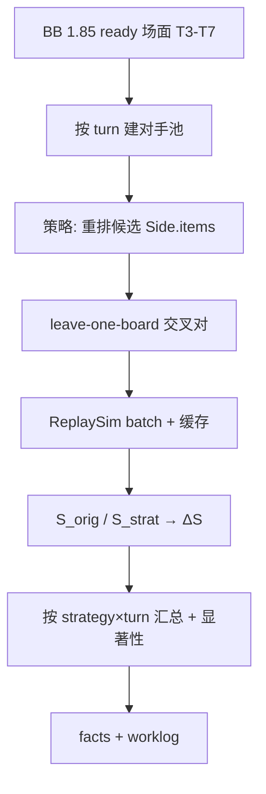

# 方案：摆位策略对战力增量的离线评估（独立分析）

- **状态：** implemented（2026-10-07；结论见 `facts/positioning-strength.md`；与方案无重大偏差）
- **任务：** 主线外研究（非 P3/P4）；交付物在 `spikes/positioning/`
- **作者 / 日期：** agent / 2026-10-07
- **相关：** ADR-0003；`facts/bobsbuddy-simulator-input.md` §3.4；`facts/strength-cross-p3t0.md`；Q-017（新建）

## 1. 目标与非目标

**要回答（有可复跑证据即可）：**

1. 在最新 BB 版本队列上，仅用**身材加权排序**类摆位规则重排 `Side.items`，相对原摆位，同回合对手池上的 \(S\)（ADR-0003）平均能抬多少？
2. 增量是否随**回合（T3–T7）**与**策略**变化？哪些组合显著为正？
3. 结论对「随机重排 / 原序反转」等负对照是否站得住？

**非目标**

- 不进产品 UI、不改 `tools/strength` 正式分位管线、不写新 ADR（除非所有者要把某策略固化进主线）。
- 不做关键词感知摆位（嘲讽钉位、裂解邻居、亡语顺序等）的穷举搜索；v1 只做可解释的全局排序规则（可另加 1–2 个「嘲讽靠左/靠右」变体作对照）。
- 不跨 BB 版本混模拟；不评估「最优摆位」穷举（\(n!\)）。

## 2. 依据

| 依据 | 用法 |
| --- | --- |
| `bobsbuddy-simulator-input.md` §3.4 | `Side` 顺序 = `ZONE_POSITION` 升序，**是模拟输入的一部分** |
| ADR-0003 | \(S(x)=\mathrm{avg}_i(P_w+0.5P_t)\)；候选不进自身参照 |
| P3-T0 / `tools/strength` | 拼装 `make_cross_input`、`ReplaySim --batch`、缓存键含完整 Input（重排后 `board_hash`/`pair_key` 自然失效，会重算） |
| dump `_data` | 排序用 `MaxAttack` / `MaxHealth`（开战时总身材；与 HDT→BB 一致） |
| Q-011 | 必须用采集时同版本 BB DLL |

**假设（若不成立则改方案）**

| # | 假设 | 若不成立 |
| --- | --- | --- |
| H1 | 只重排 `Player.Side.items`（或候选侧 `items`），其余字段不动，hydrate 后可模拟 | 先做 30 对自洽冒烟；失败则停并记事实 |
| H2 | 同回合池规模（约 60 场面/回合）足够看出 \(\Delta S\) 方向 | 只报描述统计 + 宽 CI，不宣称策略有效 |
| H3 | 「剔除自身」= 剔除同一 `boardId`，**不**做整局留出（与分位产品不同） | 若所有者要求 leave-one-game，加开关重跑对照 |

## 3. 方案



### 3.1 样本与池

- **版本：** 当前最新主队列 `1.85.0.0`（本机约 34 局 solo；可 CLI 覆盖）。
- **回合：** 3–7（含）。
- **入池场面：** 同 `tools.strength.pool.collect_boards`：`ready`（或 input+output 兼容）、非双人、非幽灵 Opponent；**默认候选与对手池均为双侧**（Player + Opponent），与「每个场面 × 该回合全体对手集」一致。
- **本机规模（2026-10-07 点查）：**

| turn | 场面数（双侧） | leave-one 对数（约） |
| ---: | ---: | ---: |
| 3 | 60 | 3540 |
| 4–7 | 62×4 | 3782×4 |
| **合计/策略** | **308** | **≈1.87e4** |

- **剔除规则：** 评估场面 \(x\) 时，对手集 = 同 turn 池 \(\setminus\{x\}\)（按 `boardId`）。不做整局留出（H3）。

### 3.2 摆位策略（v1）

对候选侧 `Side.items` 做**稳定排序**（同分保留原相对序）。分数 \(f=\)：

| id | 规则 | \(f\) |
| --- | --- | --- |
| `orig` | 不改（基线；\(\Delta S\equiv 0\)，作管线冒烟） | — |
| `atk_desc` | 攻击降序 | `MaxAttack` |
| `hp_desc` | 生命降序 | `MaxHealth` |
| `atk1_hp1` | 等权 | `A+H` |
| `atk1_hp2` | 偏血 | `A+2H` |
| `atk2_hp1` | 偏攻 | `2A+H` |
| `rev_orig` | 原序反转（负对照） | — |
| `taunt_left_atk` | 嘲讽（`_data.Taunt`）全部靠左，组内再 `atk_desc`；非嘲讽组内 `atk_desc` | 可选对照 |

默认方向：**高分在左（index 0）**。实现时用 `--direction asc|desc` 可翻（报告默认 desc）。  
**不**移动手牌/奥秘/英雄技能；**不**改攻血或附魔。

### 3.3 指标

对策略 \(r\)、回合 \(t\)、场面 \(x\)：

1. \(S_{\mathrm{orig}}(x)=\mathrm{mean}_{y\in P_t\setminus\{x\}} s(x_{\mathrm{orig}},y)\)
2. \(S_r(x)=\mathrm{mean}_{y\in P_t\setminus\{x\}} s(x_r,y)\)
3. \(\Delta S_r(x)=S_r(x)-S_{\mathrm{orig}}(x)\)

其中 \(s=\) `score_of(win,tie)`，与引擎一致。

**单元格汇总（每个 strategy×turn）：**

| 量 | 定义 |
| --- | --- |
| \(n\) | 场面数 |
| \(\overline{\Delta S}\) | 均值 |
| 中位 \(\Delta S\)、p10/p90 | 分布 |
| 提升比例 | \(\Pr(\Delta S>0)\)（平局阈值 \(\Delta S=0\) 不计正） |
| 局聚类 bootstrap 95% CI | 按 `gameId` 重采样场面集合上的 \(\overline{\Delta S}\) |

可选副指标：平均预期承伤差（若 batch 输出有 `avDamage`）。

### 3.4 显著性

| 检验 | 用法 |
| --- | --- |
| 主结论 | 局聚类 bootstrap CI：若 \(\overline{\Delta S}\) 的 95% CI **下界 > 0**，称该单元格「显著为正」 |
| 配对检验 | Wilcoxon 符号秩（\(\Delta S\) vs 0），报 \(p\)；与 CI 对照，不以单侧 p 单独定论 |
| 多重比较 | 对默认策略集（不含 `orig`）× 5 回合，BH-FDR，\(q=0.05\)；主表同时给未校正 CI |
| 负对照 | `rev_orig`：预期 \(\overline{\Delta S}\) 不显著为正；若反而显著为正，标记「原摆位系统性偏一侧」而非策略有效 |
| 置换 sanity（可选、贵） | 固定策略分数，随机置换 `items` 得 null \(\overline{\Delta S}\) 分布；仅在主策略「显著」时对 1 个 turn 做 |

**不做：** 把 \(\Delta S\) 直接等同「名次提升」或「相对 HDT 增量」（那是另一标签问题）。

### 3.5 执行与成本

- **复用：** `tools.strength.assembler` / `pool` / `batch` / `cache`；独立入口 `spikes/positioning/`（或 `python -m tools.positioning`，若所有者希望进 tools——默认 **spike**）。
- **模拟：** `iterations=500`（与 P3 默认一致）、同版本 DLL；结果写入独立 sqlite/目录，避免污染正式 `strength.jsonl` 语义（可与 `cache.sqlite` 共用 pair 缓存——键已含完整 Input，安全）。
- **成本粗估：** 每策略约 1.9e4 对 × ~0.15 s ≈ **~45–80 min**（批跑）；默认 6 条有效策略 ≈ **5–8 h** 墙钟。可先 `--strategies atk_desc,hp_desc --turns 5` 冒烟。
- **加速：** `orig` 对可命中已有 strength 缓存；同 `board_hash`+对手只算一次；多策略共享「对手侧」hydrate。

### 3.6 交付

| 路径 | 内容 |
| --- | --- |
| `spikes/positioning/` | 重排、批跑编排、统计、README |
| `docs/facts/positioning-strength.md` | 结论表（策略×回合 \(\overline{\Delta S}\)+CI+FDR） |
| `docs/research/open-questions.md` Q-017 | 问题关闭或降级 |
| `docs/worklog/` | 过程 |

## 4. 考虑过的替代方案

| 方案 | 为何不选（v1） |
| --- | --- |
| 穷举 / 局部交换搜索最优序 | 组合爆炸；本问题要的是「简单规则有无系统性帮助」 |
| 只对己方 Player 做候选 | 更贴产品语义，但与「全体场面」表述不一致；做开关 `--candidates player` 作对照即可 |
| 整局留出参照 | 偏分位无偏性；摆位 \(\Delta S\) 是场面内处理效应，leave-one-board 更贴用户描述 |
| 用分位 \(Q\) 而非 \(S\) | 重排改变全体 \(S\) 后分位重排，解读绕；主指标用 \(\Delta S\)，可附带「原分位桶内 \(\Delta S\)」 |

## 5. 验收方式

可复跑：

```powershell
python -m unittest discover -s spikes/positioning
# 冒烟：单回合单策略 + orig 自洽
python -m spikes.positioning run --bb-version 1.85.0.0 --turns 5 --strategies orig,atk_desc --limit-boards 8
# 全量
python -m spikes.positioning run --bb-version 1.85.0.0 --turns 3-7
python -m spikes.positioning report --out data/positioning/1.85.0.0/summary.json
```

| # | 验收 | 通过标准 |
| --- | --- | --- |
| 1 | 单元：重排只改 `items` 顺序，CardID 多重集不变 | 单测 |
| 2 | `orig` 的 \(\overline{\Delta S}=0\)（数值噪声 \|·\|&lt;1e-9） | 报告断言 |
| 3 | 冒烟：重排后仍可 hydrate+模拟，失败率 0（limit 样本） | 跑通 |
| 4 | 全量报告含每个 strategy×turn 的 \(n,\overline{\Delta S}\), CI, Wilcoxon p, FDR | 文件落盘 |
| 5 | 事实文档写明显著单元格与否、负对照是否干净 | `facts/positioning-strength.md` |

## 6. 风险与回退

| 风险 | 缓解 |
| --- | --- |
| \(\Delta S\) 极小（&lt; MC 噪声） | 报效应量；不夸大；必要时把 iterations 提到 2000 复验显著格 |
| 身材排序伤害裂解/亡语邻接 | 结论限定为「规则摆位」；关键词策略留后续 |
| 耗时 | 分策略落盘；可断点续跑 |
| 与正式分位混淆 | 文档与输出路径隔离；不写 `strength.jsonl` |

## 7. 任务拆分

1. **spike 骨架 + 重排单测**（`orig`/稳定排序/`MaxAttack` 读取）
2. **批跑编排**（生成 jobs → ReplaySim → 聚 \(S,\Delta S\)）
3. **统计报告**（bootstrap CI、Wilcoxon、BH-FDR）
4. **全量跑 + facts**；关闭或更新 Q-017

## 8. 请所有者拍板（实现前）

1. **候选集：** 双侧场面（默认）还是仅己方 Player？
2. **剔除：** 仅 `boardId`（默认）还是整局留出？
3. **策略表：** 上表是否够用？是否必须加「高分靠右」对称跑（成本约 ×2）？
4. **优先级：** 是否接受先冒烟（T5 + 2 策略）再全量过夜？
