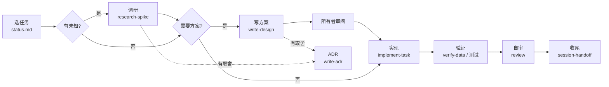

# 研发流程（SDLC）

> 这份文档回答：一个任务从开始到完成要经过哪些环节，每个环节谁负责、产出什么、用哪份提示词。

## 角色

- **所有者（人）：** 定方向和优先级；审阅方案；确认 ADR；做需要真实游戏的实测（打对局、核对画面）；最终验收。
- **Agent：** 调研、写方案、实现、测试、维护文档；遇到需要所有者判断的问题时明确提出，不自行越过。

## 流程

| 环节 | 触发条件 | 产出 | 提示词 |
| --- | --- | --- | --- |
| 选任务 | 每次会话开始 | 明确本次要做的任务编号 | 见 `AGENTS.md` 第 2 节 |
| 调研 | 任务依赖未核实的外部行为 | `facts/` 更新、`open-questions.md` 更新、worklog | [`research-spike.md`](prompts/research-spike.md) |
| 写方案 | 见 `design/README.md` | `design/P?-*.md` | [`write-design.md`](prompts/write-design.md) |
| 写 ADR | 出现有长期影响的取舍 | `decisions/NNNN-*.md` | [`write-adr.md`](prompts/write-adr.md) |
| 实现 | 方案已批准或属于小改动 | 代码 + 测试 + 小步提交 | [`implement-task.md`](prompts/implement-task.md) |
| 验证 | 涉及采集或模拟结果的改动 | 质量报告 / 往返验证结果 | [`verify-data.md`](prompts/verify-data.md) |
| 自审 | 提交前 | 问题清单及修复 | [`review.md`](prompts/review.md) |
| 版本升级 | HDT 或游戏版本更新 | 基线更新、事实复核、兼容性结论 | [`version-upgrade.md`](prompts/version-upgrade.md) |
| 收尾 | 每次会话结束 | `status.md`、worklog 更新 | [`session-handoff.md`](prompts/session-handoff.md) |

## 完成的定义（Definition of Done）

一个任务只有同时满足以下条件才能在 `roadmap.md` 里打勾：

1. 满足任务或方案里写明的验收方式，且验收过程可重复；
2. 新的事实、决定、问题已写入对应文档；
3. `status.md` 与 worklog 已更新；
4. 代码改动有测试，或写明为什么无法自动测试以及人工验证步骤；
5. 需要所有者验收的，已获得确认。

## 需要所有者参与的节点

- 方案从 `review` 到 `approved`；
- ADR 从 `proposed` 到 `accepted`；
- 需要打真实对局才能完成的实测；
- 修改 `context/vision.md` 或范围红线；
- 阶段退出。

agent 遇到这些节点时，在 `status.md` 的"阻塞 / 需要所有者决定"里写清楚要确认什么，并在对话中直接提出。
